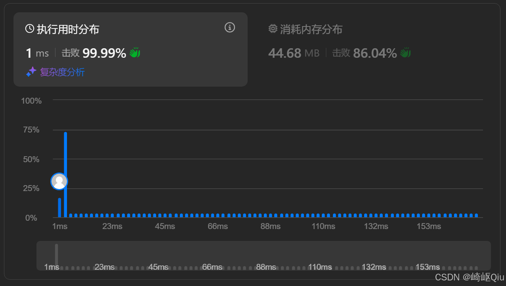

# leetcode55：跳跃游戏（贪心思想）

> 原创 于 2025-08-30 09:25:18 发布 · 公开 · 801 阅读 · 26 · 14 · CC 4.0 BY-SA版权 版权声明：本文为博主原创文章，遵循 CC 4.0 BY-SA 版权协议，转载请附上原文出处链接和本声明。
> 文章链接：https://blog.csdn.net/lyh2004_08/article/details/151010769

**文章目录**

[TOC]


[LeetCode 55，跳跃游戏](https://leetcode.cn/problems/jump-game/description/?envType=study-plan-v2&envId=top-interview-150) ，【难度：中等；通过率：44.1%】，这道题的难点在于，它并不关心我们“如何”跳到终点，而只关心我们“能否”跳到终点。这种感觉无从下手的但又到处可以下手的特性，可以尝试 **贪心** 的思路

## 一、 题目描述

给你一个非负整数数组 `nums` ，你最初位于数组的第一个位置

数组中的每个元素代表你在该位置可以跳跃的最大长度

判断你是否能够到达最后一个位置

**示例:** 

**示例 1:** 

```
输入: nums = [2,3,1,1,4]
输出: true
解释: 我们可以先跳 1 步，从下标 0 到达下标 1, 然后再从下标 1 跳 3 步到达最后一个下标
```

**示例 2:** 

```
输入: nums = [3,2,1,0,4]
输出: false
解释: 无论怎样，总会到达下标为 3 的位置。但该下标的最大跳跃长度为 0，所以永远不可能到达最后一个下标
```

---

## 二、 核心思路：贪心 - 关注“覆盖范围”

解决这道题的关键，是转变我们的思考角度。我们不需要去模拟每一种具体的跳跃路径，那会导致复杂的动态规划或回溯。相反，我们可以采用贪心策略，将问题简化为： **在每一步，我能到达的最远距离是多少？** 

我们维护一个变量，称之为“ **最大覆盖范围** ” ( `maxCover` )。这个变量代表了从起点出发，通过任意合法的跳跃，我们目前能够触及到的最远数组下标

算法的流程如下：

1. 从起点 `i = 0` 开始遍历数组

2. 我们的遍历不能超出当前已知的“最大覆盖范围”。也就是说，只有当 `i <= maxCover` 时，位置 `i` 才是我们能到达的，我们才能从 `i` 出发进行下一次跳跃的决策

3. 在每一个可到达的位置 `i` ，我们都做出一个贪心的选择：计算从这里出发能跳到的最远距离 ( `i + nums[i]` )，并用它来更新我们的全局 `maxCover` 

4. 如果在任何时刻，我们的 `maxCover` 已经大于或等于数组的最后一个下标，那么说明终点已经“被覆盖”了，我们成功了

5. 如果循环结束（意味着 `i` 已经超出了 `maxCover` ），而我们仍然没有覆盖到终点，那就说明我们被困在了某个位置，无法再前进了

---

## 三、 代码实现与深度解析

一种参考代码

```java
class Solution {
    public boolean canJump(int[] nums) {
        int i = 0;
        // maxCover 代表当前能够覆盖的最远距离下标
        int maxCover = 0;

        // 循环条件是 i <= maxCover，确保 i 的每一步都在可达范围内
        while (i <= maxCover) {
            // 如果最大覆盖范围已经到达或超过了终点，直接返回 true
            if (maxCover >= nums.length - 1) {
                return true;
            }
          
            // 贪心选择：更新最大覆盖范围
            // 我们总是选择能让我们跳得更远的可能性
            // 这就是局部最优：在当前位置 i，尽力更新全局最远覆盖范围
            maxCover = Math.max(maxCover, i + nums[i]);
          
            // 不能真正的直接跳跃，要每个遍历！！！因为这样才能找到最大覆盖范围
            // i++ 意味着我们考察下一个在当前覆盖范围内的点，
            // 看看从那里出发是否能提供一个更优的（更远的）跳跃选择
            i++;
        }
      
        // 如果循环结束，说明 i 已经超出了 maxCover，
        // 意味着我们无法再前进了，返回 false
        return false;
    }
}
```

提交结果：

 

---

## 四、 关键点与复杂度分析

-  **贪心本质** ：这道题的贪心体现在，我们每一步都更新 `maxCover` ，总是选择一个能 **让未来可能性（覆盖范围）最大化** 的决策，而 **不去纠结于下一步具体跳到哪里** 

-  **`while (i <= maxCover)`** ：这个循环条件是算法的核心。它将遍历范围 **动态地限制在当前可达的区域内** ，一旦无法扩展这个区域，循环就会自然终止

-  **时间复杂度** ： **O(N)** 虽然是 `while` 循环，但指针 `i` 只会从左到右遍历数组一次

-  **空间复杂度** ： **O(1)** 只使用了 `i` 和 `maxCover` 两个常数级别的额外变量

