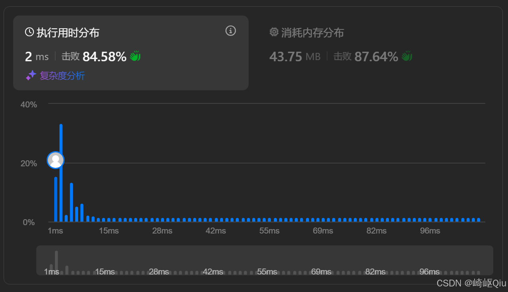

# leetcode2200：找出数组中的所有K近邻下标（基于贪心思想的单次遍历范围合并）

> 原创 于 2025-09-07 08:47:05 发布 · 公开 · 1.3k 阅读 · 41 · 30 · CC 4.0 BY-SA版权 版权声明：本文为博主原创文章，遵循 CC 4.0 BY-SA 版权协议，转载请附上原文出处链接和本声明。
> 文章链接：https://blog.csdn.net/lyh2004_08/article/details/151278266

**文章目录**

[TOC]


下面，我们来解决一道看似需要多次遍历，但实际上可以通过一次巧妙遍历解决的问题： [LeetCode 2200 - 找出数组中的所有 K 近邻下标](https://leetcode.cn/problems/find-all-k-distant-indices-in-an-array/) ，【难度：简单；通过率：64.5%】，这道题的核心在于理解题目的“ **K近邻** ”的定义，并找到一种高效的方式来生成所有满足条件的下标

## 一、 题目描述

给你一个下标从 0 开始的整数数组 `nums` 和两个整数 `key` 和 `k` 

**K 近邻下标** 是 `nums` 中的一个下标 `i` ，并满足 **至少存在一个** 下标 `j` 使得 `|i - j| <= k` 且 `nums[j] == key` 

以列表形式返回按 **递增顺序** 排序的所有 K 近邻下标

**示例 1:** 

```
输入：nums = [3,4,9,1,3,9,5], key = 9, k = 1
输出：[1,2,3,4,5,6]

解释：
nums[2] == key，其影响范围是 [2-1, 2+1] -> [1, 3]
nums[5] == key，其影响范围是 [5-1, 5+1] -> [4, 6]
合并所有范围 [1, 3] U [4, 6] 得到 [1,2,3,4,5,6]
```

**示例 2:** 

```
输入：nums = [2,2,2,2,2], key = 2, k = 2
输出：[0,1,2,3,4]

解释：每个下标都满足条件
```

---

## 二、 核心思路：从“检查”到“生成”

初看这道题，我们最直观的想法可能是：

>  **（直观朴素思路）** 遍历 `nums` 的每一个下标 `i` ，然后再去检查整个数组，看是否存在一个 `j` 满足 `nums[j] == key` 且 `|i - j| <= k` 

这个思路的时间复杂度是 O( **N²** )，效率较低

为了优化，我们需要进行一次 **思维转换** ：

>  **（优化思路）** 与其为每个 `i` 去“检查”它是否满足条件，不如我们主动出击，找到所有 `key` 所在的位置 `j` ，然后由这些 `j` 去“生成”所有满足条件的 `i` 

具体来说，每一个 `nums[j] == key` 的位置，都会产生一个**“影响范围”**， **这个范围内的所有下标都是 K 近邻下标** 。这个范围就是 `[j - k, j + k]` 

我们的任务，就变成了 **找出所有 `key` 产生的影响范围，并将这些范围合并起来** 

---

## 三、 最佳实践：单次遍历与范围合并

如何高效地合并这些范围呢？

我们可以通过一次遍历来完成，同时维护一个指针，记录我们已经添加到结果中的下标范围

**算法流程：** 

1. 初始化一个空列表 `result` 用于存储结果

2. 初始化一个指针 `start = 0` 。这个指针的含义是：“我们接下来要添加的 K 近邻下标，应该从 `start` 开始”。它巧妙地帮我们处理了范围的重叠部分

3. 遍历数组 `nums` ，下标为 `i` 

4. 当我们找到一个 `nums[i] == key` 时：
   a. 确定这个 `key` 产生的影响范围的 **左边界** 。这个左边界不能小于 `start` （因为 `start` 之前的下标已经被处理过了），也不能小于 `i - k` 。所以，左边界是 `from = Math.max(start, i - k)` 
   b. 确定影响范围的 **右边界** 。右边界不能超过数组末尾，所以是 `to = Math.min(nums.length - 1, i + k)` 
   c. 将从 `from` 到 `to` 的所有下标 `p` 加入到 `result` 列表中
   d. **更新 `start` 指针** ！这是算法的关键。我们将 `start` 更新为 `to + 1` ，因为 `to` 以及之前的下标都已经被覆盖了，下一次寻找 `key` 时，产生的新范围应该从这个新 `start` 开始

5. 遍历结束后， `result` 中就是所有按递增顺序排列的 K 近邻下标

---

## 四、 代码实现与深度解析

【一种最佳实践】

```java
class Solution {
    public List<Integer> findKDistantIndices(int[] nums, int key, int k) {
        List<Integer> result = new ArrayList<>();
        int n = nums.length;
      
        // start 指针记录下一个可以添加的 K 近邻下标的起始位置
        // 这也是处理范围重叠的关键
        int start = 0; 

        // 1: 遍历整个数组，寻找 key
        for (int i = 0; i < n; i++) {
            if (nums[i] == key) {
                // 2: 确定由当前 key 产生的 K 近邻范围
                // 左边界：不能小于 start，也不能小于 i - k
                int from = Math.max(start, i - k);
                // 右边界：不能超过数组的末尾
                int to = Math.min(n - 1, i + k);

                // 3: 将该范围内的所有下标加入结果集
                for (int p = from; p <= to; p++) {
                    result.add(p);
                }

                // 4: 更新 start 指针，避免重复添加
                // 下一次添加应该从当前范围的下一个位置开始
                start = to + 1;
            }
        }
      
        return result;
    }
}
```

提交结果：

 

---

## 五、 关键点与复杂度分析

-  **思维转换** ：本题的核心是从“为每个 `i` 检查”转变为“由每个 `key` 生成”。这是解决许多范围、邻近问题的通用优化思路

-  **`start` 指针的作用** ：它像一个“水位线”，确保了我们只添加新的、未被覆盖的下标，从而优雅地处理了多个影响范围的重叠问题，并保证了结果的有序性

-  **时间复杂度** ： **O(N)** 然代码里有嵌套循环，但外层循环遍历 `nums` 一次。内层的 `for (int p ...)` 循环，由于 `start` 指针不断前进，每个下标 `p` 从 `0` 到 `n-1` 最多只会被加入 `result` 一次。因此，所有内层循环的总执行次数也是 O(N) 级别的

-  **空间复杂度** ： **O(1)** (不考虑存储结果的 `result` 列表)。如果考虑结果列表，最坏情况下所有下标都是 K 近邻下标，空间复杂度为 O(N)

