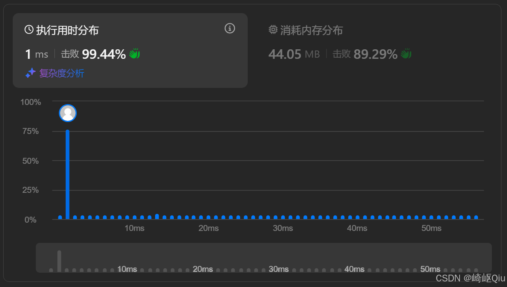

# leetcode45：跳跃游戏Ⅱ（贪心+层次扫描思想，一次遍历求最少跳数）

> 原创 于 2025-09-10 09:00:00 发布 · 公开 · 1.9k 阅读 · 50 · 42 · CC 4.0 BY-SA版权 版权声明：本文为博主原创文章，遵循 CC 4.0 BY-SA 版权协议，转载请附上原文出处链接和本声明。
> 文章链接：https://blog.csdn.net/lyh2004_08/article/details/151374288

**文章目录**

[TOC]


[LeetCode-45 跳跃游戏Ⅱ](https://leetcode.cn/problems/jump-game-ii/description/) （难度：中等；通过率：45.2%） 这道题与上一题“ **跳跃游戏Ⅰ** ”的区别在于，上一题只要求找到“能否”到达最后，而本题在题目数据保障可以到达最后的情况下，求 **“最少跳跃的次数”** 

核心还是使用贪心思路寻求时间复杂度 **O(N)** 的解法：每个位置给出当前点可向前跳的最大步数。目标是从起点（索引 0）到达终点（索引 n-1）的“最少跳跃次数”。即采用“区间扩展 + 层次扫描”的贪心思路，在一次线性扫描中求解最优答案

## 一、题目描述

- 给定非负整数数组 nums，其中 nums[i] 表示从位置 i 最多可以向前跳的步数。

- 从索引 0 出发，求到达最后一个位置（索引 n-1）的最少跳跃次数。

- 测试数据保证一定可以到达终点。

**示例** 

```
输入: nums = [2,3,1,1,4]
输出: 2
解释: 跳到最后一个位置的最小跳跃数是 2。
     从下标为 0 跳到下标为 1 的位置，跳 1 步，然后跳 3 步到达数组的最后一个位置。
```

直观理解：把每次“跳跃”看作 **选择一个“跳跃区间”** ，希望用尽可能少的区间扩展，就覆盖到数组尾部。

---

## 二、核心思路 - 从“区间扩展”到“层次扫描”

- 我们用两个指针维护当前这一跳能覆盖的“探测区间”：[start, currentEnd]。在扫描该区间内的每个 i 时，不断更新能到达的“下一层最远边界”maxReach = max(maxReach, i + nums[i])。

- 当 i 扫描到 currentEnd，说明“当前 **这一跳的覆盖范围”已经完全考察完毕** ，我们必须进行一次跳跃（ans++），并把下一跳的覆盖边界 **更新** 为 currentEnd = maxReach。

- 如此反复，就像在一幅一维图上做 BFS 的“层次推进”： **每推进一层，跳跃次数 +1** ；当某次推进已经覆盖或越过终点时，答案确定。

这一策略的本质：在当前能到达的所有位置里，优先选择能把“ **下一轮覆盖边界** ”推得最远的方案（ **贪心** ）。

> 有 `maxReach` 和 `currentEnd` 两个 int 记录，也可以算是 **“双指针”** 。

---

## 三、原理简析（贪心为何正确）

- 层次边界：在第 k 次跳跃时，currentEnd 标识“第 k 次跳跃最多能覆盖的最右端点”。在扫描该区间的过程中，我们计算下一层最远可达 maxReach。

- 贪心选择：在所有可选落点中，我们只关心能把下一轮边界推得最远的那个落点，因为这能减少未来需要的总体层数（跳数）。

- 直观考量：若当前选择落点 A，而另一个落点 B 能让下一层边界更远，则从 A 未来可达的范围一定被 B 覆盖或更优，因而把选择从 A 替换成 B 不会增加后续跳数。

- BFS 等价视角：把每个 i 视为图节点，nums[i] 决定从 i 能到达的边集合。以层次遍历的方式，从左到右扩张“可达区间”。层数即最少跳数。

---

## 四、代码实现

下面代码为一次遍历的贪心实现，注释分块解释关键变量语义与推进逻辑：

```java
class Solution {
    public int jump(int[] nums) {
        int len = nums.length;
        if (len <= 1) return 0; // 只有一个元素，无需跳跃

        int ans = 0;        // 最少跳跃次数（层数）
        int currentEnd = 0; // 当前这一跳（当前层）的最远覆盖右边界
        int maxReach = 0;   // 扫描当前层期间，下一层能达到的最远边界

        // 关键：只需扫描到 len - 2（当到达最后一个位置时不必再向后扩展）
        for (int i = 0; i < len - 1; i++) {
            // 不断更新下一层的最远可达位置
            maxReach = Math.max(maxReach, i + nums[i]);

            // 当扫描到当前层的边界时，必须完成一次“层切换”（即：做一次跳跃）
            if (i == currentEnd) {
                ans++;
                currentEnd = maxReach; // 下一层的覆盖边界确定

                // 如果已经能够覆盖到或越过终点，可以提前结束
                if (currentEnd >= len - 1) break;
            }
        }
        return ans;
    }
}
```

提交结果：

 

 

---

## 五、关键点与复杂度分析

- 不必回溯：我们只在当前层内扫描并维护 maxReach，层与层之间单调推进，无需二次扫描。

- 提前结束：一旦 currentEnd 覆盖末尾（>= n-1），答案可直接确定。

- 不访问末尾：for 只到 len-2 即可，避免在抵达终点后多一次无意义的“层切换”。

- 最优性直觉：每层都将下一层边界推进到最远，能保证整体层数最少（见原理部分）。

复杂度：

- 时间复杂度：O(n)，一次线性扫描。

- 空间复杂度：O(1)，常数额外空间。

---

## 六、边界情况的特殊考量测试

- n = 1 时返回 0（已经在终点）。

- 数组中可能出现 0，但题目保证可达，贪心扫描仍能推进到覆盖终点的层。

- 变量语义要清晰：currentEnd 表示“本层边界”，maxReach 表示“下一层最远边界”。

- 保持循环不越界：只遍历到 len - 2，避免多余计数。

简单走查示例：[2, 3, 1, 1, 4]

- 初始：ans = 0，currentEnd = 0，maxReach = 0

- i = 0：maxReach = max(0, 0 + 2) = 2，到边界 i == currentEnd（0）⇒ ans = 1，currentEnd = 2

- i = 1：maxReach = max(2, 1 + 3) = 4

- i = 2：maxReach = max(4, 2 + 1) = 4，到边界 i == currentEnd（2）⇒ ans = 2，currentEnd = 4 ≥ n-1 ⇒ 提前结束，答案 2

---

## 七、两题简单对比

- 与 [跳跃游戏Ⅰ](https://blog.csdn.net/lyh2004_08/article/details/151010769) 的关系：判断能否到达终点（I）与最少跳数（II）共享“最远可达”的核心变量，但 II 多了“层次边界切换”的计数逻辑。

- BFS/DP 的视角：

  - BFS 明确体现“层”的概念，但在数组上用双指针（currentEnd、maxReach）即可隐式完成层次遍历，复杂度更低。

  - DP 可以做，但会退化为 O( **n^2** )；在该题上不如贪心一趟扫描高效。

- 如何恢复路径：若还需输出具体落点路径，可在更新 maxReach 的同时记录“使得 maxReach 变更的下标”作为前驱，再自右向左回溯

