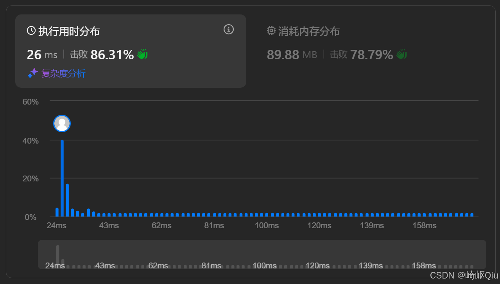

# leetcode380：RandomizedSet - O(1)时间插入删除和获取随机元素（数组+哈希表的巧妙结合）

> 原创 已于 2025-09-11 18:45:34 修改 · 公开 · 883 阅读 · 31 · 19 · CC 4.0 BY-SA版权 版权声明：本文为博主原创文章，遵循 CC 4.0 BY-SA 版权协议，转载请附上原文出处链接和本声明。
> 文章链接：https://blog.csdn.net/lyh2004_08/article/details/151586021

**文章目录**

[TOC]


[Leetcode：380. O(1) 时间插入、删除和获取随机元素](https://leetcode.cn/problems/insert-delete-getrandom-o1/) ，（难度：中等；通过率：52.7%），这道题要求我们设计一个 **数据结构** ，支持在 **平均O(1) **时间复杂度下进行** 插入、删除和获取随机元素** 操作

单一数据结构很难同时满足这三个要求，但通过 **数组和哈希表** 的巧妙结合，我们可以完美解决这个问题

## 一、题目描述

设计一个支持在平均时间复杂度O(1) 下，执行以下操作的数据结构：

-  `insert(val)` ：当元素 val 不存在时，向集合中插入该项，并返回 true；否则，返回 false

-  `remove(val)` ：当元素 val 存在时，从集合中移除该项，并返回 true；否则，返回 false

-  `getRandom()` ：随机返回现有集合中的一项，每个元素被返回的概率应该相同

**关键约束** ：所有操作的 **平均时间复杂度** 都必须是 O(1)

---

## 二、核心思路 - 数组+哈希表的完美配合

单一数据结构的局限性显而易见：

-  **数组** ：支持O(1)随机访问和尾部插入，但删除中间元素需要O(n)

-  **哈希表** ：支持O(1)插入和删除，但无法O(1)随机访问

-  **链表** ：插入删除O(1)，但随机访问需要O(n)

为了同时满足所有O(1)操作，我们采用 **数组 + 哈希表** 的组合方案：

-  **数组 `list`** ：用于存储实际元素，这保证了 `getRandom` 可以通过随机索引实现O(1)访问

-  **哈希表 `map`** ：用于存储 `元素值 -> 数组索引` 的映射，这保证了 `insert` 和 `remove` 操作可以O(1)地判断元素是否存在并找到其位置

核心技巧在于 **删除操作时的"末尾替换法"** 。当需要删除一个非末尾元素时，我们不直接移动数组元素（这会导致O(n)开销），而是用数组的 **最后一个元素覆盖** 要删除的元素，然后删除数组末尾。这样，删除操作也变成了O(1)

---

## 三、算法原理（为何能达到O(1)）

我们将每个操作分解，可以看到其时间复杂度均为O(1)：

-  **插入操作 `insert(val)`** ：

  1.  **哈希表查重** ： `map.containsKey(val)` ，O(1)

  2.  **数组尾部添加** ： `list.add(val)` ，O(1)

  3.  **哈希表记录索引** ： `map.put(val, list.size() - 1)` ，O(1)

-  **删除操作 `remove(val)`** ：

  1.  **哈希表查找索引** ： `map.get(val)` ，≈ O(1)

  2.  **末尾元素覆盖** ： `list.set(index, lastElement)` ，O(1)

  3.  **更新哈希表映射** ： `map.put(lastElement, index)` ，≈ O(1)

  4.  **删除数组末尾** ： `list.remove(list.size() - 1)` ，O(1)

  5.  **删除哈希表目标** ： `map.remove(val)` ，O(1)

-  **随机获取 `getRandom()`** ：

  1.  **生成随机索引** ： `random.nextInt(list.size())` ，O(1)

  2.  **数组随机访问** ： `list.get(randomIndex)` ，O(1)

**关键洞察** ：通过"末尾替换"的技巧，我们巧妙地将数组的O(n)删除操作转化为了O(1)操作，而哈希表则始终提供O(1)的查找能力，二者结合，完美达成了目标

---

## 四、代码实现

下面是完整的实现代码，注释详细说明了每个操作的关键步骤：

```java
import java.util.ArrayList;
import java.util.HashMap;
import java.util.Random;

class RandomizedSet {
    ArrayList<Integer> list;  // 存储实际元素
    HashMap<Integer, Integer> map;  // 元素值 -> 数组索引的映射
    Random r;  // 随机数生成

    public RandomizedSet() {
        list = new ArrayList<>(15);  // 初始容量优化
        map = new HashMap<>();
        r = new Random();
    }
    
    // 辅助方法：检查元素是否存在
    private boolean isExist(int val) {
        return map.get(val) != null;
    }
    
    // 插入元素
    public boolean insert(int val) {
        if (isExist(val)) {
            return false;  // 元素已存在
        }
        // 1. 添加到数组末尾
        list.add(val);
        // 2. 在哈希表中记录 元素值 -> 索引 的映射
        map.put(val, list.size() - 1);
        return true;
    }
    
    // 删除元素（核心：末尾替换）
    public boolean remove(int val) {
        if (!isExist(val)) {
            return false;  // 元素不存在
        }
        
        // 1.获取要删除元素的索引
        int indexOfCur = map.get(val);
        int lastIndex = list.size() - 1;
        int lastVal = list.get(lastIndex);
        
        // 2.用末尾元素覆盖要删除的元素
        list.set(indexOfCur, lastVal);
        
        // 3.删除数组末尾元素
        list.remove(lastIndex);
        
        // 4.更新被移动元素在哈希表中的索引映射
        map.put(lastVal, indexOfCur);

        // 5.从哈希表中移除被删除的元素（注意：必须在更新lastVal映射之后）
        map.remove(val);

        return true;
    }
    
    // 随机获取元素
    public int getRandom() {
        int randIndex = r.nextInt(list.size());
        return list.get(randIndex);
    }
}
```

提交记录：

 

---

## 五、关键点与复杂度分析

-  **设计要点** ：

  -  **组合优势** ：数组负责存储和O(1)随机访问，哈希表负责O(1)快速定位

  -  **核心技巧** ：删除时的"末尾替换法"是避免数组元素移动、保证O(1)性能的关键

  -  **更新顺序** ：删除时，对哈希表的更新顺序很重要。一个稳妥的顺序是：获取信息 -> 修改数组 -> 修改哈希表 -> 删除数组末尾

-  **复杂度分析** ：

  -  **时间复杂度** ： `insert()` 、 `remove()` 、 `getRandom()` 均为 O(1) 平均时间

  -  **空间复杂度** ：O(n)，其中 n 是集合中元素的个数。数组和哈希表都需要O(n)的空间

---

## 六、常见坑点与边界用例

-  **删除的元素是最后一个元素** ：

  - 当要删除的 `val` 正好是数组的最后一个元素时， `indexOfCur` 和 `lastIndex` 相等。代码逻辑 `list.set(indexOfCur, lastVal)` 相当于自己覆盖自己， `map.put(lastVal, indexOfCur)` 也是用同样的值更新，逻辑依然正确，无需特殊处理

-  **哈希表 `remove` 和 `put` 的顺序** ：

  - 在 `remove` 操作中，如代码注释所示， `map.put()` 更新被移动的末尾元素的索引，必须在 `map.remove()` 删除目标元素的键值对之前。如果顺序反了，且被删除元素是最后一个元素，就会出错（因为 `lastVal` 等于 `val` ， **先删除后添加会把它重新加回去** ）

-  **空集合** ：

  - 题目保证调用 `getRandom()` 时集合非空，因此代码中 **无需** 对 `list.size()` 为0的情况做额外检查

---

## 七、扩展思考

-  **变种问题：允许重复元素怎么办？** 

  - 如果允许重复元素，哈希表的映射关系需要变为 `值 -> 索引集合` ，即 `HashMap<Integer, Set<Integer>>` 。删除时，从Set中任取一个索引进行末尾替换操作，然后从Set中移除该索引

-  **设计模式启发** ：

  - 这是 **组合优于继承** 的典型例子：通过组合两种数据结构的优势来解决单一结构的局限

  - 体现了 **空间换时间** 的权衡：额外的哈希表空间换取了时间复杂度的优化

