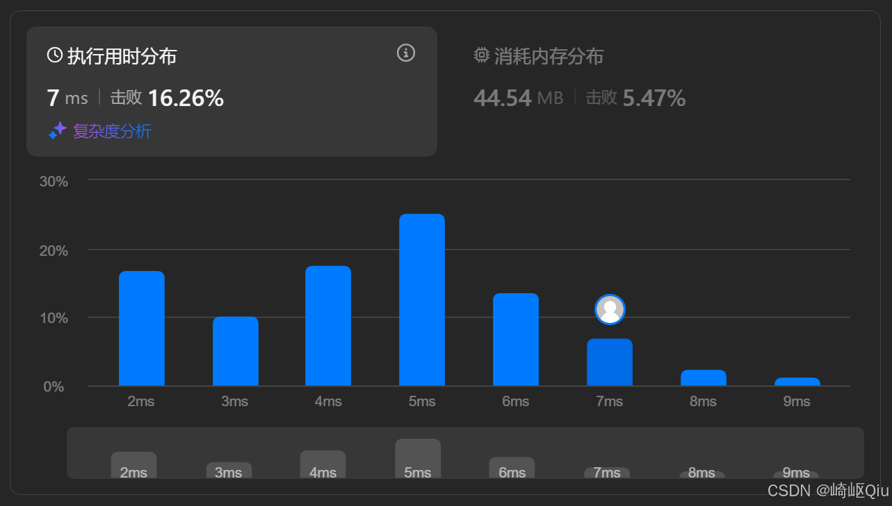
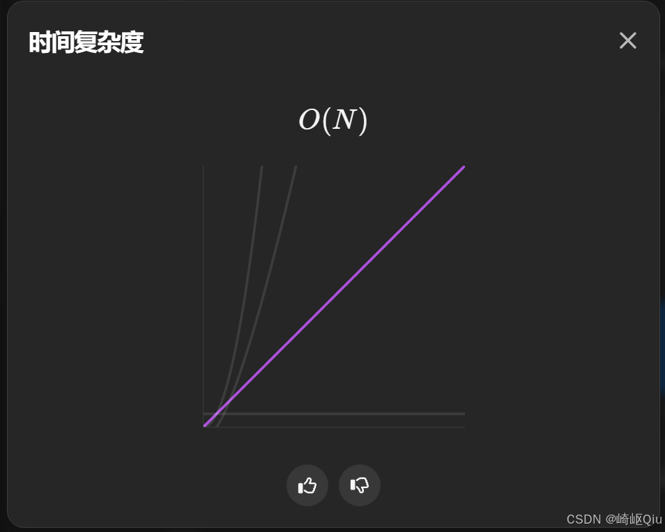

# leetcode13：罗马数字转整数（哈希表模拟）

> 原创 于 2025-09-11 19:07:33 发布 · 公开 · 950 阅读 · 22 · 23 · CC 4.0 BY-SA版权 版权声明：本文为博主原创文章，遵循 CC 4.0 BY-SA 版权协议，转载请附上原文出处链接和本声明。
> 文章链接：https://blog.csdn.net/lyh2004_08/article/details/151586323

**文章目录**

[TOC]


[leetcode13：罗马数字转整数](https://leetcode.cn/problems/roman-to-integer/description/) ，（难度：简单；通过率：64.3%），顾名思义，将罗马符号表示的数字，转为阿拉伯数字

## 一、 题目描述

罗马数字包含以下七种字符: `I` ， `V` ， `X` ， `L` ， `C` ， `D` 和 `M` 

| 字符 | 数值 |
|:---|:---|
| I | 1 |
| V | 5 |
| X | 10 |
| L | 50 |
| C | 100 |
| D | 500 |
| M | 1000 |


例如， 罗马数字 `2` 写做 `II` ，即为两个并列的 1 。 `12` 写做 `XII` ，即为 `X` + `II` 。 `27` 写做 `XXVII` , 即为 `XX` + `V` + `II` 

通常情况下，罗马数字中小的数字在大的数字的右边。但也存在 **特例** ，例如 4 不写做 `IIII` ，而是 `IV` 。数字 1 在数字 5 的左边，所表示的数等于大数 5 减小数 1 得到的数值 4 。同样地，数字 9 表示为 `IX` 

这个特殊的规则只适用于以下六种情况：

-  `I` 可以放在 `V` (5) 和 `X` (10) 的左边，来表示 4 和 9

-  `X` 可以放在 `L` (50) 和 `C` (100) 的左边，来表示 40 和 90

-  `C` 可以放在 `D` (500) 和 `M` (1000) 的左边，来表示 400 和 900

给定一个罗马数字，将其转换成整数

**示例 1:** 

```
输入: s = "III"
输出: 3
```

**示例 2:** 

```
输入: s = "IV"
输出: 4
```

**示例 3:** 

```
输入: s = "MCMXCIV"
输出: 1994
解释: M = 1000, CM = 900, XC = 90, IV = 4.
```

**提示：** 

-  `1 <= s.length <= 15` 

-  `s` 仅含字符 ( `'I'` , `'V'` , `'X'` , `'L'` , `'C'` , `'D'` , `'M'` )

- 题目数据保证 `s` 是一个有效的罗马数字，且表示整数在范围 `[1, 3999]` 内

## 二、 直观思路：哈希表模拟

解决这个问题最简单的解法，就是最直观的解法，即 **模拟** ；唯一需要注意的地方就是：正确处理罗马数字的 **两种情况** ：

1.  **常规情况** ：大数在左，小数在右，直接累加。例如 `VI` = 5 + 1 = 6

2.  **特殊情况** ：小数在左，大数在右，需要用大数减小数。例如 `IV` = 5 - 1 = 4

我们可以采用一种直接的模拟思路，从左到右遍历输入的罗马数字字符串。为了方便处理，我们可以预先将所有可能的基础罗马字符（如 “I”, “V”）和特殊的组合字符（如 “IV”, “IX”）及其对应的整数值 **存储在一个哈希表** 中

算法流程如下：

1.  **初始化哈希表** ：创建一个哈希表，将所有7个基本字符和6个特殊组合字符作为键，对应的整数值作为值

2.  **从左到右遍历** ：使用一个指针 `index` 从字符串的开头开始遍历

3.  **开始匹配** ：在当前 `index` 位置，我们 **优先** 尝试匹配一个 **两位** 的特殊组合字符（例如 `s.substring(index, index + 2)` ）

   - 如果在哈希表中找到了这个两位组合，说明遇到了 “IV”, “IX” 这样的 **特殊情况** 。我们将对应的值累加到结果 `ans` 中，并将指针 `index` 向后移动两位

   - 如果没有找到两位组合，说明当前位置是一个 **常规的单字符** 。我们就在哈希表中查找这个 **一位** 字符，将其对应的值累加到 `ans` ，并将指针 `index` 向后移动一位

4.  **循环直至结束** ：重复步骤 3，直到指针 `index` 遍历完整个字符串。

5.  **返回结果** ：最终得到的 `ans` 就是转换后的整数

这种方法通过优先匹配更长的特殊组合，简单直观，且逻辑上并没有漏洞

## 三、 代码实现与深度解析

基于上述的直观想法，代码实现：

```java
public class Solution {
    public int romanToInt(String s) {
        HashMap<String, Integer> map = new HashMap<>();
        initMap(map);
        int ans = 0, index = 0, len = s.length();
        while (index < len) {
            // 优先尝试匹配两位特殊字符
            String twoChar = s.substring(index, Math.min(index + 2, len) /** 防止数组下标越界 **/);
            Integer t = map.get(twoChar);
            
            if (t != null && twoChar.length() == 2) { // 确保是两位匹配
                ans += t;
                index += 2;
            } else {
                // 否则，匹配一位常规字符
                String oneChar = s.substring(index, index + 1);
                t = map.get(oneChar);
                ans += t;
                index++;
            }
        }
        return ans;
    }

    private void initMap(HashMap<String, Integer> map) {
        map.put("I", 1);
        map.put("V", 5);
        map.put("X", 10);
        map.put("L", 50);
        map.put("C", 100);
        map.put("D", 500);
        map.put("M", 1000);
        
        map.put("IV", 4);
        map.put("IX", 9);
        map.put("XL", 40);
        map.put("XC", 90);
        map.put("CD", 400);
        map.put("CM", 900);
    }
}
```

提交结果：

 

 

## 四、 关键点与复杂度分析

-  **优先选择** ：这种直观的思路有些类似“贪心”。在每个位置，我们总是 **优先尝试匹配最长** 的可能性（两位字符如果匹配，那么一定是正确的，因为所有的两位字符的情况，都被添加到map中了）。如果成功，就能正确处理特殊情况；如果不成功，再回退到处理常规的单位字符。这保证了逻辑的正确性

-  **哈希表** ：使用哈希表来存储罗马数字到整数的映射，提供了 O(1) 的查找效率，是该解法的关键数据结构

-  **边界处理** ：在提取子字符串时，需要注意 `index + 2` 可能会超出字符串长度 `len` 的边界情况。使用 `Math.min(index + 2, len)` 或类似的检查可以有效避免 `IndexOutOfBoundsException` 

-  **时间复杂度：O(N)** 
  其中 N 是输入字符串 `s` 的长度。我们只需要从头到尾遍历一次字符串，哈希表的查找操作是 O(1) 的，所以总时间复杂度是线性的

-  **空间复杂度：O(1)** 
  我们使用了一个哈希表来存储映射关系。但是，这个哈希表的大小是固定的（13个条目），不随输入字符串的长度变化而变化。因此，所占用的空间是常数级别的

