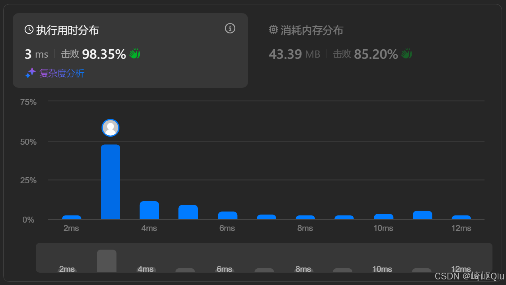

# leetcode12：整数转罗马数字（贪心算法的精妙应用）

> 原创 于 2025-09-12 09:00:00 发布 · 公开 · 1.2k 阅读 · 28 · 9 · CC 4.0 BY-SA版权 版权声明：本文为博主原创文章，遵循 CC 4.0 BY-SA 版权协议，转载请附上原文出处链接和本声明。
> 文章链接：https://blog.csdn.net/lyh2004_08/article/details/151586876

**文章目录**

[TOC]


**上一篇** 我们解决了 [leetcode13：罗马数字转整数](https://blog.csdn.net/lyh2004_08/article/details/151586323) ，然后本篇是它的“逆向问题”—— [leetcode12：将整数转换为罗马数字](https://leetcode.cn/problems/integer-to-roman/description/) ，（难度：中等；通过率：69.0%），这道题同样是考察对罗马数字构造规则玩法，但解决思路却截然不同（更像一个“凑不同面额的钱”的问题），最优解是 **贪心** 思路

## 一、 题目描述

罗马数字由七个不同的符号表示： `I` , `V` , `X` , `L` , `C` , `D` 和 `M` 

| 符号 | 值 |
|:---|:---|
| I | 1 |
| V | 5 |
| X | 10 |
| L | 50 |
| C | 100 |
| D | 500 |
| M | 1000 |


例如， `2` 写成 `II` ，即两个 `1` 并列。 `12` 写成 `XII` ，即 `X` + `II` 。 `27` 写成 `XXVII` ，即 `XX` + `V` + `II` 

通常，罗马数字中小的数字在大的数字的右边。但是，也存在一些特殊情况，例如 `4` 不写成 `IIII` ，而是 `IV` 。数字 `1` 在 `5` 的左边，表示 `5` 减 `1` 得到 `4` 。同样， `9` 表示为 `IX` 。此特殊规则适用于以下六种情况：

-  `I` 可以放在 `V` (5) 和 `X` (10) 的左边，表示 4 和 9

-  `X` 可以放在 `L` (50) 和 `C` (100) 的左边，表示 40 和 90

-  `C` 可以放在 `D` (500) 和 `M` (1000) 的左边，表示 400 和 900

给你一个整数，将其转为罗马数字

**示例 1:** 

```
输入: num = 3
输出: "III"
```

**示例 2:** 

```
输入: num = 58
输出: "LVIII"
解释: L = 50, V = 5, III = 3.
```

**示例 3:** 

```
输入: num = 1994
输出: "MCMXCIV"
解释: M = 1000, CM = 900, XC = 90, IV = 4.
```

**提示：** 

-  `1 <= num <= 3999` 

## 二、 核心思路：贪心 - 优先换“大钱”

这道题最直观也最高效的解法就是 **贪心算法** 。我们可以把罗马数字的构造过程想象成一个“换钱”过程

假设有一些面值不同的人民币（100元, 50元, 20元, 10元, 5元, 1元），现在要凑出 188 元。最自然的策略是什么？

肯定是 **优先用最大面值的钱** 。先用一张100的，剩下88；再用一张50的，剩下38；再用一张20的，剩下18；再用一张10的，剩下8；再用一张5的，剩下3；最后用三张1元的

> 实际上这就是罗马数字的表示 **原则** ：在一个数值有 **多种“组合”方式** 的情况下，能用大额表示，优先选择大额，这样，即便有多种 <u>组合</u> 方式，最终的 <u>实际表示</u> 却是唯一的

整数转罗马数字的逻辑完全一样。罗马数字的“面值”就是 `M` (1000), `CM` (900), `D` (500), `CD` (400), `C` (100), `XC` (90), `L` (50), `XL` (40), `X` (10), `IX` (9), `V` (5), `IV` (4), `I` (1)

注意，我们必须把 `CM` (900) 这种组合也考虑进来，并且放在 `D` (500) 和 `C` (100) 之前，这样才能保证贪心的正确性（例如，对于900，我们 **优先选择 `CM`** 而不是 `D` + `C` + `C` + `C` + `C` ），换句话说，这也算一种“ **面额** ”

算法流程如下：

1.  **建立映射** ：创建两个数组，一个存储罗马数字的“面值” `values` ，另一个存储对应的符号 `symbols` 。关键在于，这两个数组必须 **从大到小** 严格排序

2.  **循环与减法** ：从最大的面值 `values[0]` (1000) 开始遍历

3.  **贪心选择** ：用一个 `while` 循环，判断当前整数 `num` 是否大于等于当前面值 `values[i]` 

   - 如果是，说明“钱够换”，就将 `num` 减去这个面值，并把对应的罗马符号 `symbols[i]` 追加到结果字符串中

   - 重复这个过程，直到 `num` 小于当前面值（即这张“大钱”换不了了）

4.  **遍历下一个面值** ：继续遍历下一个稍小一点的面值，重复步骤 3

5.  **结束条件** ：当 `num` 减为 0 时，说明转换完成，循环可以提前结束

## 三、 代码实现与深度解析

最佳实践：

```java
class Solution {
    // 预先定义好从大到小的“面值”和对应的“符号”
    int[] values = {1000, 900, 500, 400, 100, 90, 50, 40, 10, 9, 5, 4, 1};
    String[] symbols = {"M", "CM", "D", "CD", "C", "XC", "L", "XL", "X", "IX", "V", "IV", "I"};

    public String intToRoman(int num) {
        // 核心原理：罗马数字的唯一表示的原则是优先向大值拆
        StringBuilder sb = new StringBuilder(); // StringBuilder性能相较于StringBuffer更高
        // 遍历所有定义好的“面值”（已经从大到小排序，按此顺序遍历即可）
        for (int i = 0; i < values.length; i++) {
            int value = values[i];
            // 只要当前数字还够被当前面值减，就一直减
            while (num >= value) { // 只要还够减，优先用大的“占位”
                num -= value;
                sb.append(symbols[i]); // 追加对应索引的roman符号
            }
            // 如果num已经为0，可以提前结束循环
            if (num == 0) {
                break;
            }
        }
        return sb.toString();
    }
}
```

提交结果：

 

## 四、 关键点与复杂度分析

-  **贪心选择的正确性** ：该算法的正确性建立在罗马数字的表示规则之上。通过将特殊组合（如 `CM` , `CD` , `XC` 等）视为独立的“面值”并优先处理，我们确保了对于任何一个整数，总是能通过优先减去最大可能的值来得到唯一的罗马表示

-  **硬编码的映射表** ：将 `values` 和 `symbols` 硬编码在代码中，并保证其从大到小的顺序，是实现贪心策略的基础。这个映射表是固定的，不随输入变化

-  **时间复杂度：O(1)** 
  虽然代码中有一个 `for` 循环和一个 `while` 循环，但循环的次数是有限的。 `for` 循环最多执行13次（ `values` 数组的长度）。对于 `while` 循环，每个面值最多被使用几次也是有上限的（例如， `M` 最多3次， `I` 最多3次）。因此，总的操作次数是一个常数，不随输入 `num` 的大小而显著变化（在题目 `1 <= num <= 3999` 的限制下）

-  **空间复杂度：O(1)** 
  除了存储结果的 `StringBuilder` 外，我们只使用了两个固定大小的数组。 `StringBuilder` 的空间取决于结果罗马数字的长度，而最长的罗马数字长度也是有限的。因此，空间复杂度可以认为是常数级别

## 五、 与上一题（罗马数字转整数）的对比

两题目对比

|  |  **整数 -> 罗马 (本题)**  |  [ **罗马 -> 整数 (上一题)** ](https://blog.csdn.net/lyh2004_08/article/details/151586323)  |
|:---|:---|:---|
|  **核心算法**  |  **贪心算法**  |  **哈希表模拟 / 字符串处理**  |
|  **处理方向**  |  **构造** ：从无到有，用大块拼凑出目标 |  **解析/模拟** ：从左到右，解析已有结构，处理特殊组合 |
|  **数据流**  |  `int` -> `while` 循环减法 -> `String`  |  `String` -> `substring` 匹配 -> `int` 累加 |
|  **关键数据结构**  |  **有序数组** ：用于从大到小进行贪心选择 |  **哈希表** ：用于快速查找单个或组合罗马字符对应的值 |
|  **思维模式**  |  **“ <u>换钱</u> ”思维** ：需要凑 `num` 元，优先出什么面值的“钱”？ |  **“阅读”思维** ：读到一个字符/字符串，它代表什么意思？ |