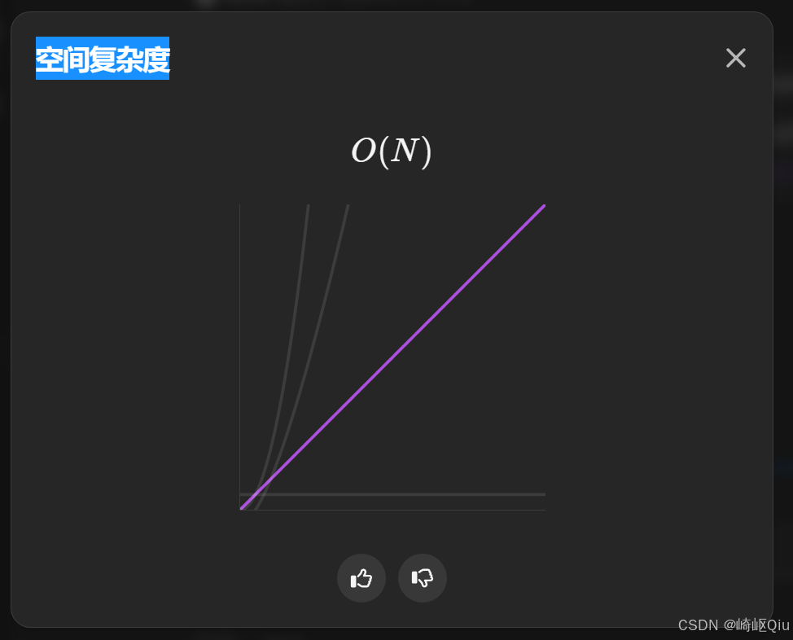
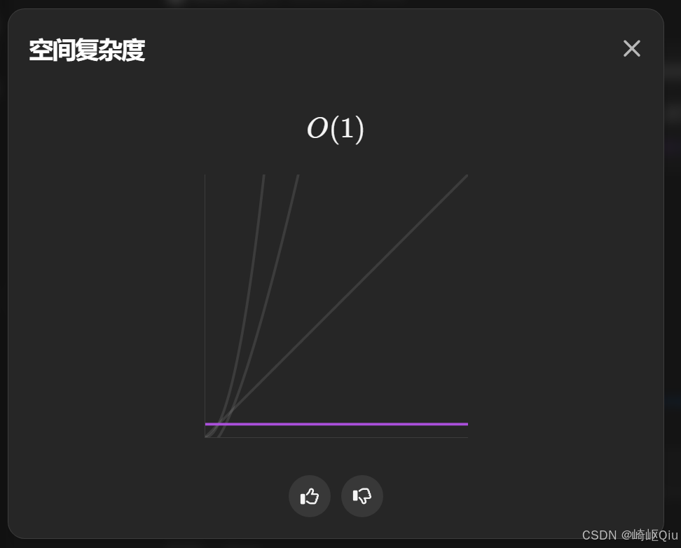

# leetcode151：反转字符串中的单词（正则化预处理与双指针原地解法）

> 原创 于 2025-09-13 10:42:32 发布 · 公开 · 676 阅读 · 12 · 19 · CC 4.0 BY-SA版权 版权声明：本文为博主原创文章，遵循 CC 4.0 BY-SA 版权协议，转载请附上原文出处链接和本声明。
> 文章链接：https://blog.csdn.net/lyh2004_08/article/details/151646609

**文章目录**

[TOC]


[LeetCode 151. 反转字符串中的单词](https://leetcode.cn/problems/reverse-words-in-a-string/) ，（难度：中等；通过率：59.1%），这道题看似简单，却暗藏 **字符串预处理** 与 **双指针技巧** 两大经典套路。本文先给出一行正则 + `split` 的简洁做法，再分享 O(1) 额外空间的原地双指针思路

---

## 一、题目描述

> 给你一个字符串 `s` ，请你反转字符串中 **单词** 的顺序。单词由非空格字符组成， `s` 中使用至少一个空格将单词分隔开。返回单词顺序颠倒且单词之间仅用单个空格连接的结果

示例：

| 输入 | 输出 |
|:---:|:---:|
|  `"the sky is blue"`  |  `"blue is sky the"`  |
|  `" hello world "`  |  `"world hello"`  |
|  `"a good example"`  |  `"example good a"`  |


额外要求（进阶）：如果字符串在 **你使用的编程语言中** 是一种可变数据类型，请尝试使用 **O(1) 额外空间复杂度** 的 **原地** 解法

---

## 二、思路分析

1.  **去除冗余空格** ：题目要求结果中只有一个空格分隔，意味着要去掉首尾空格 + 压缩中间多个空格

2.  **单词分割** ：一旦空格处理完毕，利用分割即可拿到所有单词

3.  **反转组合** ：将分割得到的单词倒序拼接即可

> 关键坑点：直接对原字符串 `split(" ")` 会把连续空格分割出很多 “” 空串，导致结果错误。因此需要使用正则 or 双指针先压缩空格

---

## 三、代码实现（Java/ 简洁版）

下面这段代码利用正则 `"\\s+"` 将 **1~N** 个空白字符视为分隔符，一行搞定空格压缩 + 分割，随后倒序拼接即可

```java
class Solution {
    public String reverseWords(String s) {
        // 1.去除首尾空格，按连续空白分割得到单词数组
        String[] words = s.trim().split("\\s+");
        // 2.倒序拼接
        StringBuilder sb = new StringBuilder();
        for (int i = words.length - 1; i >= 0; i--) {
            sb.append(words[i]);
            if (i > 0) sb.append(' '); // 单词间加空格
        }
        return sb.toString();
    }
}
```

**提交结果：** 

 

### 复杂度

-  **时间复杂度** ： `O(N)` ， `trim` 与 `split` 均线性扫描一次

-  **空间复杂度** ： `O(N)` ， `split` 产生的数组存储单词

---

## 四、进阶：O(1) 空间双指针原地解法

如果思考能否 **原地反转** ？可以考虑：

1. 先将整串字符反转

2. 再逐个单词反转回来

3. 最后在同一数组中压缩冗余空格

> 这个思路，有些类似 [leetcode189：轮转数组（原地后移数组的最佳实践解法）](https://blog.csdn.net/lyh2004_08/article/details/150694920) 中的 **三次翻转法** 

示意步骤（以 `" hello world "` 为例）：

```
原字符串：__hello__world__
1) 整串反转：__dlrow__olleh__
2) 单词反转：__world__hello__
3) 空格压缩：world hello
```

> 该方法仅使用常数级双指针变量，满足 **O(1)** 额外空间

完整代码如下：

```java
class Solution {
    // 原地反转 + 双指针，O(1) 额外空间
    public String reverseWords(String s) {
        char[] ch = s.toCharArray();
        int n = ch.length;
        // 1.整串反转
        reverse(ch, 0, n - 1);
        // 2.逐个单词反转回来
        int start = 0, end;
        while (start < n) {
            // 跳过空格
            while (start < n && ch[start] == ' ') {
                start++;
            }
            if (start >= n) break;
            end = start;
            while (end < n && ch[end] != ' ') {
                end++;
            }
            reverse(ch, start, end - 1);
            start = end;
        }

        // 3.压缩空格并构建结果
        StringBuilder sb = new StringBuilder();
        for (int i = 0; i < n; ) {
            if (ch[i] != ' ') {
                sb.append(ch[i++]);
            } else {
                sb.append(' '); // 保留一个空格
                while (i < n && ch[i] == ' ') {
                    i++; // 跳过多余空格
                }
            }
        }

        // 4.去除首尾可能的空格
        int len = sb.length();

        if (len > 0 && sb.charAt(0) == ' ') {
            sb.deleteCharAt(0);
        }

        if (len > 1 && sb.charAt(sb.length() - 1) == ' ') {
            sb.deleteCharAt(sb.length() - 1);
        }

        return sb.toString();
    }

    private void reverse(char[] ch, int l, int r) {
        while (l < r) {
            char tmp = ch[l];
            ch[l++] = ch[r];
            ch[r--] = tmp;
        }
    }
}
```

**提交结果：** 

 

---

## 五、小结

- 字符串题目常见套路： **预处理 → 分割/提取 → 再处理/拼接** 

- 正则 `"\\s+"` 在需要压缩连续空白时非常好用；注意 `trim()` 只能去除首尾空白

- 关注进阶条件：能否 O(1) 空间 / 原地解。不一定要写出，但要思路清晰

