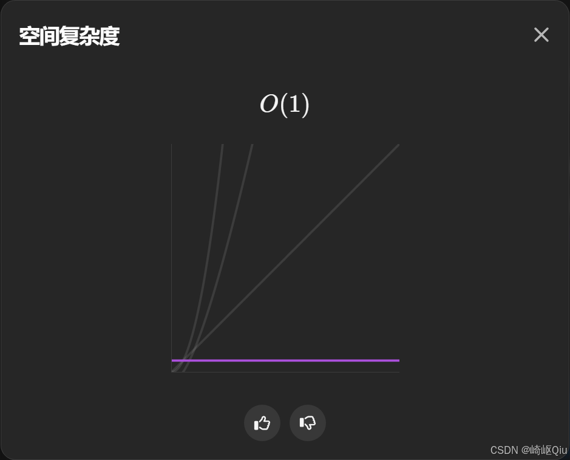

# leetcode58：最后一个单词的长度（尾指针逆向扫描，结合151反转字符串对比）

> 原创 于 2025-09-13 10:51:20 发布 · 630 阅读 · 17 · 18 · CC 4.0 BY-SA版权 版权声明：本文为博主原创文章，遵循 CC 4.0 BY-SA 版权协议，转载请附上原文出处链接和本声明。
> 文章链接：https://blog.csdn.net/lyh2004_08/article/details/151646971

**文章目录**

[TOC]


[LeetCode 58. 最后一个单词的长度](https://leetcode.cn/problems/length-of-last-word/) （难度：简单；通过率：48.3%），本题可以看作 **字符串反向遍历的经典 <u>入门</u> 题** 。有了上一题 [LeetCode 151. 反转字符串中的单词](https://blog.csdn.net/lyh2004_08/article/details/151646609) 的铺垫，本题只需保留 *最后一个单词* 的长度信息即可，逻辑极其简单

---

## 一、题目描述

> 给你一个字符串 `s` ，由若干单词组成，单词前后用一些空格字符隔开。返回字符串中 **最后一个单词** 的长度
> 
> 单词仅由字母组成，不包含任何空格字符

示例：

| 输入 | 输出 | 说明 |
|:---:|:---:|:---:|
|  `"Hello World"`  |  `5`  | 最后一个单词是 “World” |
|  `" fly me to the moon "`  |  `4`  | 最后一个单词是 “moon” |
|  `"luffy is still joyboy"`  |  `6`  | 最后一个单词是 “joyboy” |


---

## 二、思路分析

与 151 题需要 **反转所有单词顺序** 不同，58 题只关心 **最后一个单词** 。因此不必对整串进行复杂处理， **一个指针从尾部向前扫描** 即可：

1.  **跳过尾部空格** （如果有）

2.  **统计遇到的连续字母个数** ，直到再遇到空格或字符串开始位置

3. 统计值即为答案

由于过程只使用常数指针变量，时间复杂度 `O(N)` ，空间复杂度 `O(1)` 

---

## 三、代码实现（Java/ 逆向扫描）

```java
class Solution {
    public int lengthOfLastWord(String s) {
        int len = 0;    // 记录最后一个单词的长度
        int i = s.length() - 1;

        // 1.跳过尾部连续空格
        while (i >= 0 && s.charAt(i) == ' ') i--;

        // 2.统计最后一个单词的长度
        while (i >= 0 && s.charAt(i) != ' ') {
            len++;
            i--;
        }
        return len;
    }
}
```

**提交结果：** 

 

 

> 该写法比常见的 `split(" ")` 更高效：避免了创建额外数组与正则开销，且满足题意中的 **O(1) 额外空间** 

### 复杂度

-  **时间复杂度** ： `O(N)` ，最坏情况下扫描一次整个字符串

-  **空间复杂度** ： `O(1)` ，只使用常数变量

---

## 四、与 151 题的对比与迁移思考

|  | 58. 最后一个单词长度 | 151. 反转字符串中的单词 |
|:---:|:---:|:---:|
| 关注目标 | 最后一个单词 | 所有单词的顺序 |
| 典型做法 | 单指针逆向扫描 | 正则/双指针+整体反转/局部反转 |
| 空间需求 |  `O(1)` 常数 |  `O(1)` （原地）或 `O(N)` （正则+split） |
| 额外难点 | 无 | 去除多余空格、保持单个空格连接 |


可以看到，两题的 **核心动作都是从字符串尾部出发** ：

- 151 题需要整串反转 → 单词再反转 → 压缩空格

- 58 题只需在 **跳过空格后计算长度** ，直接返回

---

## 五、小结

- 面对字符串题， **明确需求** （是操作所有单词还是最后一个？）可极大简化难度

- 逆向扫描思路常用于处理 **尾部空格** 与 **结尾单词** 相关的题目

