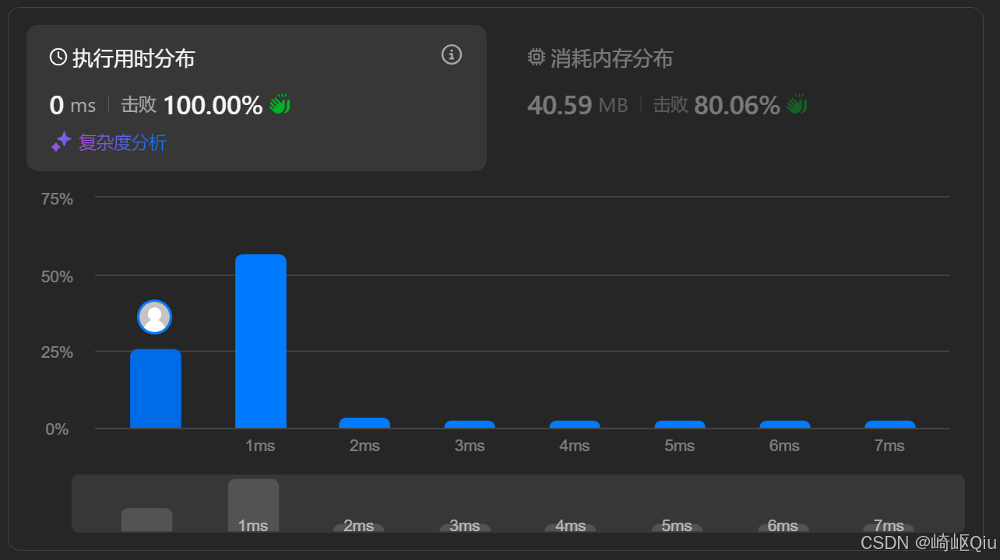
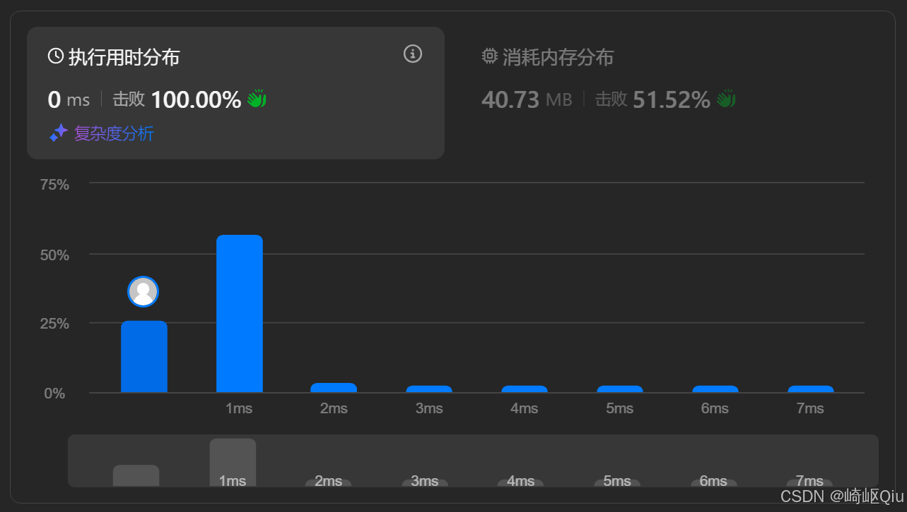

# leetcode14：最长公共前缀（逐步截短前缀法与排序优化）

> 原创 于 2025-09-15 09:00:00 发布 · 公开 · 589 阅读 · 9 · 10 · CC 4.0 BY-SA版权 版权声明：本文为博主原创文章，遵循 CC 4.0 BY-SA 版权协议，转载请附上原文出处链接和本声明。
> 文章链接：https://blog.csdn.net/lyh2004_08/article/details/151676565

**文章目录**

[TOC]


[LeetCode 14. 最长公共前缀](https://leetcode.cn/problems/longest-common-prefix/) （难度：简单；通过率：45%），一题串起 **字符串遍历** 、 **前缀截短** 、 **排序优化** 等多种套路，并补充一种基于排序的写法进行横向思考

---

## 一、题目描述

> 编写一个函数来查找字符串数组中的 **最长公共前缀** 。如果不存在公共前缀，返回空字符串 “”

示例：

| 输入 | 输出 | 说明 |
|:---:|:---:|:---:|
|  `["flower","flow","flight"]`  |  `"fl"`  |  `fl` 是全部字符串的公共前缀 |
|  `["dog","racecar","car"]`  |  `""`  | 不存在公共前缀 |


---

## 二、思路一：逐步截短前缀

1. 先把 **第 1 个字符串** 当作候选前缀 `prefix` 

2. 从第 2 个字符串开始，挨个判断：若当前字符串不以 `prefix` 开头（ `indexOf(prefix) != 0` ），则 **截掉 `prefix` 的最后一个字符** ，直至满足条件或 `prefix` 为空

3. 若循环完毕仍未为空， `prefix` 即为最长公共前缀

> 为什么可行？ 实际上只需要理解了 **“公共”** 与 **“最长”** 即可
> 
> 

- 每次截短最多删除 1 个字符，最坏情况相当于遍历所有字符，总复杂度仍是 `O(∑len)` 

-  `indexOf` 在 Java 底层实现中为 **KMP 优化过的暴力匹配** ，单次比较 `O(len)` ，总体复杂度仍然可接受

### Java 代码

```java
class Solution {
    public String longestCommonPrefix(String[] strs) {
        // 1.默认第一个字符串为公共前缀
        String prefix = strs[0];
        // 2.遍历剩余字符串
        for (int i = 1; i < strs.length; i++) {
            // 若当前字符串不以 prefix 开头，则缩短 prefix
            while (!strs[i].startsWith(prefix)) {
                prefix = prefix.substring(0, prefix.length() - 1);
                // 缩到空串还不匹配，直接返回 ""
                if (prefix.isEmpty()) return "";
            }
        }
        return prefix;
    }
}
```

提交结果：

 

 

### 复杂度分析

-  **时间复杂度** ： `O(N * M)` ， `N` 为字符串数量， `M` 为最长字符串长度。每次 `startsWith` 最多比较 `M` 个字符

-  **空间复杂度** ： `O(1)` ，只使用常数级变量

---

## 三、思路二：排序 + 首尾比较

将字符串数组按 **字典序排序** 后， **最长公共前缀必然是排在最前 & 最后的字符串的公共前缀** 

理由：排序后，其他字符串会和它们拥有不短于该前缀的相同部分

```java
class Solution {
    public String longestCommonPrefix(String[] strs) {
        Arrays.sort(strs);
        String first = strs[0];
        String last = strs[strs.length - 1];
        int i = 0;
        while (i < first.length() && i < last.length() && first.charAt(i) == last.charAt(i)) {
            i++;
        }
        return first.substring(0, i);
    }
}
```

提交结果：

 

-  **时间复杂度** ：排序 `O(N log N)` + 一次线性比较 `O(M)` 

-  **空间复杂度** ： `O(log N)` （排序递归栈）或 `O(1)` 

当 `N` 很大而单个字符串较短时，排序方法反而可能更快；当字符串很长、 `N` 小时，则逐步截短法更优