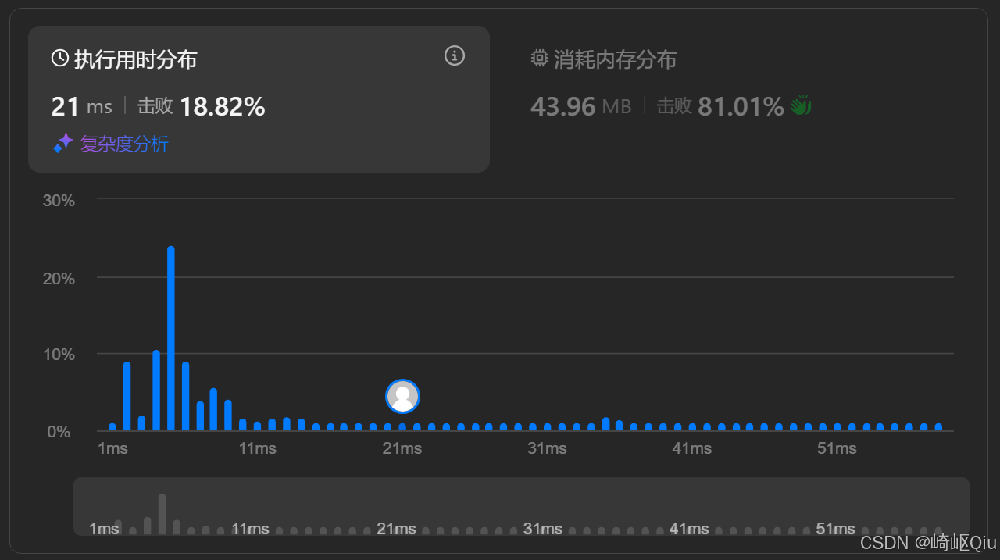
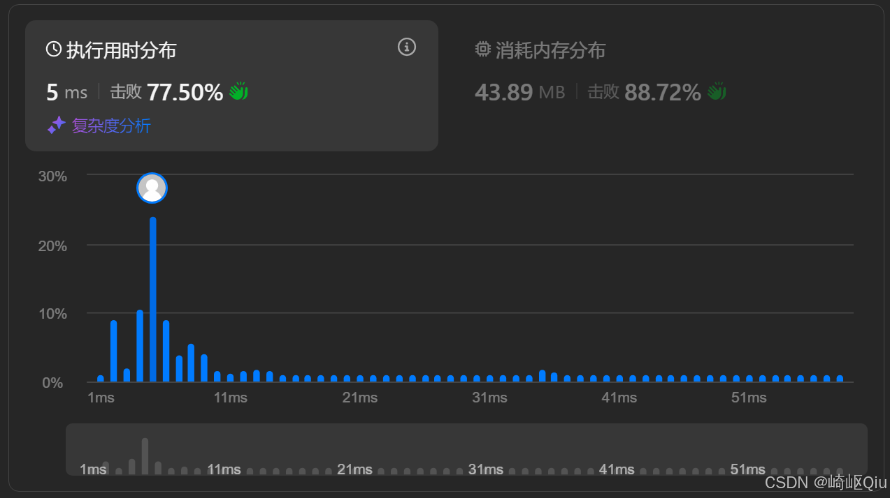

# leetcode6：Z 字形变换（行索引预计算法与按行拼接优化）

> 原创 于 2025-09-15 09:15:00 发布 · 公开 · 1k 阅读 · 9 · 13 · CC 4.0 BY-SA版权 版权声明：本文为博主原创文章，遵循 CC 4.0 BY-SA 版权协议，转载请附上原文出处链接和本声明。
> 文章链接：https://blog.csdn.net/lyh2004_08/article/details/151682777

**文章目录**

[TOC]


[LeetCode 6. Z 字形变换](https://leetcode.cn/problems/zigzag-conversion/) （难度：中等；通过率：54%）。本题表面是字符串重排，核心却是 **找规律 + 行列映射** ，虽然Z字形看似需要复杂的索引操纵，但是有一个关键技巧，不必复杂化

---

## 一、题目描述

> 将一个给定字符串 `s` 根据给定的行数 `numRows` ，以从上往下、从左到右进行 **Z 字形排列** ，再按行读取得到新的字符串
> 
> 例如 `s = "PAYPALISHIRING"` , `numRows = 3` 时：
> 
> ```
> P   A   H   N
> A P L S I I G
> Y   I   R
> ```
> 
> 读取结果为 `"PAHNAPLSIIGYIR"` 

---

## 二、思路一：预计算行索引（规律发现与模拟）

将问题拆解为两步： **“发现规律”** 和 **“按规律重建”** 

### 规律发现

Z字形变换的本质，是原字符串中的每个字符 `s[i]` ，都对应到了一个新矩阵的 `(行, 列)` 。但我们不必真的构建矩阵，只需要关注 **行** 的变化规律

对于 `s = "PAYPALISHIRING", numRows = 3` ：

-  `P` 在第 `1` 行

-  `A` 在第 `2` 行

-  `Y` 在第 `3` 行

-  `P` 在第 `2` 行

-  `A` 在第 `1` 行

-  `L` 在第 `2` 行

- …

我们发现，行号的变化是一个 **“触顶/触底反弹”** 的过程： `1 -> 2 -> 3 -> 2 -> 1 -> 2 -> ...` 。这个规律可以用一个 `direction` 标志位完美模拟

### 实现步骤

1.  **第一趟遍历 (O(N)) - 预计算行号** ：

   - 创建一个 `line` 数组， `line[i]` 用来存储原字符串中第 `i` 个字符的目标行号

   - 用一个 `flag` (或 `down` ) 变量模拟方向。从第1行开始向下，碰到第 `numRows` 行就调转方向向上；碰到第1行就再次调转方向向下

   - 通过一次遍历，我们就将抽象的“Z字形”转换成了一个具体的、可供查询的 `line` 数组

2.  **第二趟遍历 (O(numRows * N)) - 按行收集** ：

   - 现在问题简化为：我们有一个字符数组 `cs` 和一个行号数组 `line` 

   - 我们从第 `1` 行开始，遍历到第 `numRows` 行。对于每一行 `r` ，我们都完整扫描一遍 `line` 数组，把所有 `line[j] == r` 的字符 `cs[j]` 收集起来，按顺序放入结果中

### Java代码

```java
class Solution {
    public String convert(String s, int numRows) {
        if (numRows == 1) {
            return s;
        }

        char[] cs = s.toCharArray();
        int n = cs.length;
        int[] line = new int[n]; // 与cs对应，记录每个字符在矩阵中的“行”数

        boolean down = true; // true: 向下
        line[0] = 1;
        // 步骤1：预计算每个字符的行号
        for (int i = 1; i < n; i++) {
            line[i] = line[i - 1] + (down ? 1 : -1);
            // 触顶或触底，则反转方向
            if (line[i] == numRows || line[i] == 1) down = !down;
        }

        char[] ans = new char[n]; // 答案数组
        int idx = 0;
        // 步骤2：按行号顺序，从原串中收集字符
        for (int r = 1; r <= numRows; r++) {
            for (int i = 0; i < n; i++) {
                if (line[i] == r) ans[idx++] = cs[i];
            }
        }
        return new String(ans);
    }
}
```

**提交结果：** 

 

#### 复杂度

-  **时间** ： `O(N + numRows * N)` 。当 `numRows` 较大时，复杂度会趋近于 `O(N^2)` 

-  **空间** ： `O(N)` ，用于存储 `line` 数组和结果数组

-  **优点** ：思路清晰，将复杂问题分解为“找规律”和“重建”两个独立子问题

---

## 三、思路二：按行拼接（直接模拟 O(N)）

既然最终结果是按行拼接的，我们何不直接在遍历时，就把字符放到对应行的“篮子”里呢？这样就可以省去第二步的 `O(numRows * N)` 扫描

### 实现步骤

1. 创建 `numRows` 个 `StringBuilder` ，分别代表Z字形的每一行

2. 遍历原字符串 `s` ，同时维护 **当前行号 `curRow`** 和 **方向 `down`** 

3. 对于每个字符 `c` ，直接将它 `append` 到 `rows.get(curRow)` 这个 `StringBuilder` 中

4. 然后，根据 `curRow` 是否在顶部 `0` 或底部 `numRows - 1` 来更新方向 `down` 

5. 最后，根据方向更新 `curRow` 

6. 遍历结束后，将所有 `StringBuilder` 按顺序拼接起来，就是最终答案

### Java 代码

```java
class Solution {
    public String convert(String s, int numRows) {
        if (numRows == 1 || s.length() <= numRows) {
            return s;
        }
        List<StringBuilder> rows = new ArrayList<>(numRows);
        for (int i = 0; i < numRows; i++) {
            rows.add(new StringBuilder());
        }

        int curRow = 0;
        boolean down = false; // 首字符视为向下
        for (char c : s.toCharArray()) {
            rows.get(curRow).append(c);
            // 遇到顶/底行就转向
            if (curRow == 0 || curRow == numRows - 1) {
                down = !down;
            }
            curRow += down ? 1 : -1;
        }

        StringBuilder res = new StringBuilder();
        for (StringBuilder rowSb : rows) {
            res.append(rowSb);
        }
        return res.toString();
    }
}
```

**提交结果：** 

 

-  **时间复杂度** ： `O(N)` ，仅一次遍历

-  **空间复杂度** ： `O(N)` ，所有字符被分散存储于多行 `StringBuilder` 

---

## 五、小结

-  **思路一（预计算）** ：拆解清晰，将“找规律”和“构造” **分离** ，但牺牲了时间性能

-  **思路二（按行拼接）** ：是更高效的实现，它将规律的模拟和字符串的构造融合在了一次遍历中

-  **模拟问题** 常见套路： **先找规律 → 建立映射 → 一次遍历/多次遍历收集结果** 

