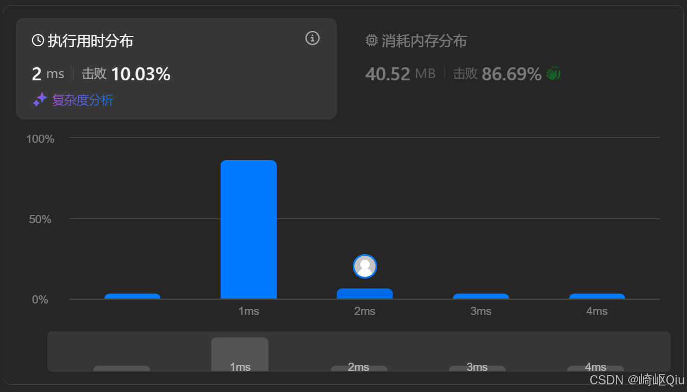

# leetcode290：单词规律（双哈希表验证模式映射）

> 原创 于 2025-09-16 09:00:00 发布 · 公开 · 1k 阅读 · 24 · 16 · CC 4.0 BY-SA版权 版权声明：本文为博主原创文章，遵循 CC 4.0 BY-SA 版权协议，转载请附上原文出处链接和本声明。
> 文章链接：https://blog.csdn.net/lyh2004_08/article/details/151726099

**文章目录**

[TOC]


[LeetCode 290. 单词规律](https://leetcode.cn/problems/word-pattern/) （难度：简单；通过率：45.3%）。本题是 LeetCode 205. 同构字符串 的直接进阶版，考察的是从 **字符-字符** 映射到 **字符-单词** 映射的思维迁移能力。本文将 **复用双哈希表的思想** ，并简单对比两题

---

## 一、题目描述

> 给定一种 `pattern` （模式）和一个字符串 `s` ，判断 `s` 是否遵循相同的模式
> 
> 这里的 **遵循** 指的是完全匹配，也就是说， `pattern` 中的每个字母和字符串 `s` 中的每个非空单词之间存在着一个 **双向连接** 的对应关系

示例：

|  `pattern`  |  `s`  | 输出 | 说明 |
|:---|:---|:---|:---|
|  `"abba"`  |  `"dog cat cat dog"`  |  `true`  |  `a` -> `dog` , `b` -> `cat` (双向唯一) |
|  `"abba"`  |  `"dog cat cat fish"`  |  `false`  |  `b` 映射到 `cat` ，但最后一个 `b` 试图映射到 `fish`  |
|  `"aaaa"`  |  `"dog cat cat dog"`  |  `false`  |  `a` 不能同时映射到 `dog` 和 `cat`  |
|  `"abba"`  |  `"dog dog dog dog"`  |  `false`  |  `a` 和 `b` 不能都映射到 `dog`  |


---

## 二、核心思想：从“同构”到“单词规律”

这道题的核心与 205 题完全一致： **验证一个双射关系** 

唯一的区别在于映射的“单元”变了：

- 在 205 题中，我们比较的是 `char` 与 `char` 

- 在 290 题中，我们比较的是 `char` ( `pattern` 中) 与 `String` ( `s` 中的单词)

因此，我们只需进行一个简单的预处理：将字符串 `s` 按空格分割成一个单词数组 `String[]` 。然后，就可以 **完全套用 [205 题的双哈希表解法](https://blog.csdn.net/lyh2004_08/article/details/151726049)** 

思路：

1.  **预处理** ：使用 `s.split("\\s+")` 将 `s` 转换为单词数组 `strs` 

2.  **长度校验** ：如果 `pattern` 的长度和 `strs` 的长度不一致，则不可能匹配，直接返回 `false` 

3.  **双哈希表** ：

   -  `map_p_s` : 记录 `pattern[i] -> strs[i]` 的映射

   -  `map_s_p` : 记录 `strs[i] -> pattern[i]` 的映射

4.  **遍历检查** ：逐一检查每个 `(pattern[i], strs[i])` 对，确保其双向映射关系不被破坏

---

## 三、代码实现（双哈希表优化版）

最终优化代码：

```java
class Solution {
    public boolean wordPattern(String pattern, String s) {
        String[] words = s.split("\\s+"); // 按照空格分割
        if (pattern.length() != words.length) {
            return false;
        }
        
        // 正向映射: pattern char -> word
        Map<Character, String> p2w = new HashMap<>();
        // 反向映射: word -> pattern char
        Map<String, Character> w2p = new HashMap<>();
        
        for (int i = 0; i < pattern.length(); i++) {
            char p = pattern.charAt(i);
            String w = words[i];
            
            // 检查映射是否冲突
            // 1：pattern中已记录的p的映射不是w
            // 2：s中已记录的w的映射不是p
            if ((p2w.containsKey(p) && !p2w.get(p).equals(w)) || 
                (w2p.containsKey(w) && w2p.get(w) != p)) {
                return false;
            }
            
            // 建立双向映射
            p2w.put(p, w);
            w2p.put(w, p);
        }
        
        return true;
    }
}
```

**提交结果：** 

 

### 复杂度分析

-  **时间复杂度** ： `O(N + M)` ，其中 `N` 是 `pattern` 的长度， `M` 是字符串 `s` 的总长度。 `split()` 操作需要 `O(M)` ，遍历需要 `O(N)` 

-  **空间复杂度** ： `O(C + W)` ，其中 `C` 是 `pattern` 中不同字符的数量， `W` 是 `s` 中不同单词的数量。空间用于存储哈希表的映射关系

---

## 四、同构问题对比：LC290 与 LC205

这两道题是理解“一一映射”模式的很好组合

|  | LeetCode 290: 单词规律（本题） |  **[LeetCode 205: 同构字符串](https://blog.csdn.net/lyh2004_08/article/details/151726049)**  |
|:---|:---|:---|
|  **映射单元**  |  `char` -> `String` (单词) |  `char` -> `char`  |
|  **输入 `s`**  | 一个由单词和空格组成的句子 | 一个完整的字符串 |
|  **输入 `t`**  | 一个由字符组成的 `pattern` 串 | 一个完整的字符串 |
|  **预处理**  | 需要用 `split()` 将句子切分成单词数组 | 无 |
|  **核心逻辑**  | 验证 `char` 与 `String` 的双向唯一映射 | 验证 `char` 与 `char` 的双向唯一映射 |
|  **关键工具**  | 两个 `HashMap` ( `<Character, String>` 和 `<String, Character>` ) | 两个 `HashMap<Character, Character>`  |


通过对比可以看出，290 题只是在 205 题的基础上增加了一个字符串预处理步骤，底层的算法思想是 **完全复用** 的。在解决问题时，应首先识别其核心的 **“算法模式”** 

---

## 五、小结

-  **双哈希表** 在解决“一一映射”问题上的有效性，是验证双射关系的首选数据结构

