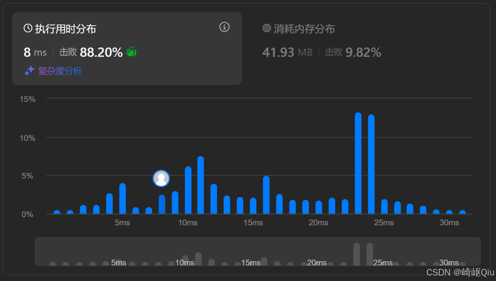

# leetcode205：同构字符串（双哈希表验证双向映射）

> 原创 于 2025-09-16 09:00:00 发布 · 公开 · 1.1k 阅读 · 26 · 24 · CC 4.0 BY-SA版权 版权声明：本文为博主原创文章，遵循 CC 4.0 BY-SA 版权协议，转载请附上原文出处链接和本声明。
> 文章链接：https://blog.csdn.net/lyh2004_08/article/details/151726049

**文章目录**

[TOC]


[LeetCode 205. 同构字符串](https://leetcode.cn/problems/isomorphic-strings/) （难度：简单；通过率：50.3%）。本题是检验 **“一一映射”** 关系的入门题，核心在于如何高效判断两个序列间的映射是否 **双向唯一** 。本文将通过 **双哈希表** 方案实现快速解决

---

## 一、题目描述

> 给定两个字符串 `s` 和 `t` ，判断它们是否是同构的。
> 
> 如果 `s` 中的字符可以按某种映射关系替换得到 `t` ，那么这两个字符串是同构的。
> 
> 每个出现的字符都应当映射到另一个字符，同时不改变字符的顺序。 **不同字符不能映射到同一个字符上，相同字符只能映射到同一个字符上** ，字符可以映射到自己本身。

示例：

| 输入 | 输出 | 说明 |
|:---:|:---:|:---:|
|  `s = "egg", t = "add"`  |  `true`  |  `e` -> `a` , `g` -> `d` (双向唯一) |
|  `s = "foo", t = "bar"`  |  `false`  |  `o` 不能同时映射到 `a` 和 `r`  |
|  `s = "paper", t = "title"`  |  `true`  |  `p` -> `t` , `a` -> `i` , `e` -> `l` , `r` -> `e`  |


---

## 二、核心思想：双向映射

题目的关键在于“同构”关系必须是 **双向绑定** 的，这在数学上称为“双射”（函数关系）

1.  **正向唯一性** ： `s` 中的一个字符 `s[i]` 只能映射到 `t` 中的一个字符 `t[i]` 。例如， `s="foo", t="bar"` ， `f` 映射到 `b` ，第一个 `o` 映射到 `a` ，但第二个 `o` 却要映射到 `r` ，破坏了唯一性，所以 `false` 

2.  **反向唯一性** ： `t` 中的一个字符 `t[i]` 也只能被 `s` 中的一个字符 `s[i]` 映射。例如， `s="ab", t="aa"` ， `a` 映射到 `a` ， `b` 也映射到 `a` 。虽然正向看 `a` 和 `b` 都有唯一的去处，但反向看， `t` 中的 `a` 被 `s` 中的 `a` 和 `b` 两个字符映射，破坏了唯一性，所以 `false` 

**使用两个哈希表，一个负责正向映射，一个负责反向映射** 

-  `map_s_t` : 记录 `s[i] -> t[i]` 的映射

-  `map_t_s` : 记录 `t[i] -> s[i]` 的映射

在遍历过程中，对每个字符对 `(s[i], t[i])` 进行检查，一旦发现任何一方的映射关系被破坏，立即返回 `false` 

---

## 三、代码实现（双哈希表优化版）

最终简化的代码：

```java
class Solution {
    public boolean isIsomorphic(String s, String t) {
        if (s.length() != t.length()) {
            return false;
        }
        
        // 正向映射：s -> t
        Map<Character, Character> s2t = new HashMap<>();
        // 反向映射：t -> s
        Map<Character, Character> t2s = new HashMap<>();
        
        for (int i = 0; i < s.length(); i++) {
            char x = s.charAt(i);
            char y = t.charAt(i);
            
            // 检查映射是否冲突
            // 1. s中已记录的x的映射不是y
            // 2. t中已记录的y的映射不是x
            if ((s2t.containsKey(x) && s2t.get(x) != y) || 
                (t2s.containsKey(y) && t2s.get(y) != x)) {
                return false;
            }
            
            // 建立双向映射
            s2t.put(x, y);
            t2s.put(y, x);
        }
        
        return true;
    }
}
```

**提交结果：** 

 

### 复杂度分析

-  **时间复杂度** ： `O(N)` ，其中 `N` 是字符串的长度。我们只需要遍历一次字符串

-  **空间复杂度** ： `O(K)` ，其中 `K` 是字符串中不同字符的数量。最坏情况下， `K` 接近 `N` ，空间复杂度为 `O(N)` 。 `K` 也受限于字符集的大小（如ASCII码为128或256）

---

## 四、同构问题对比：LC205 与 LC290

LeetCode 290. 单词规律 是本题的直接变体，核心思想完全一致，只是映射的“单元”发生了变化

|  | LeetCode 205: 同构字符串（本题） |  **[LeetCode 290: 单词规律](https://blog.csdn.net/lyh2004_08/article/details/151726099)**  |
|:---|:---|:---|
|  **映射单元**  |  `char` -> `char`  |  `char` -> `String` (单词) |
|  **输入 `s`**  | 一个完整的字符串 | 一个由字符组成的 `pattern` 串 |
|  **输入 `t`**  | 一个完整的字符串 | 一个由单词和空格组成的句子 |
|  **预处理**  | 无 | 需要用 `split()` 将句子切分成单词数组 |
|  **核心逻辑**  | 验证 `char` 与 `char` 的双向唯一映射 | 验证 `char` 与 `String` 的双向唯一映射 |
|  **关键工具**  | 两个 `HashMap<Character, Character>`  | 两个 `HashMap` ( `<Character, String>` 和 `<String, Character>` ) |


通过对比可以看出，掌握了 205 题的双哈希表思想，就能轻易地将该模式迁移到 290 题上，基本是一毛一样的

---

## 五、小结

- “同构”问题的本质是验证 **双射** 关系，即一一对应的映射

-  **双哈希表** 是解决此类问题的标准且高效的工具，一个用于正向检查，一个用于反向检查，确保映射不冲突

- 当遇到类似的模式匹配问题时，优先思考是否需要满足 **“双向 <u>唯一</u> 性”** 

