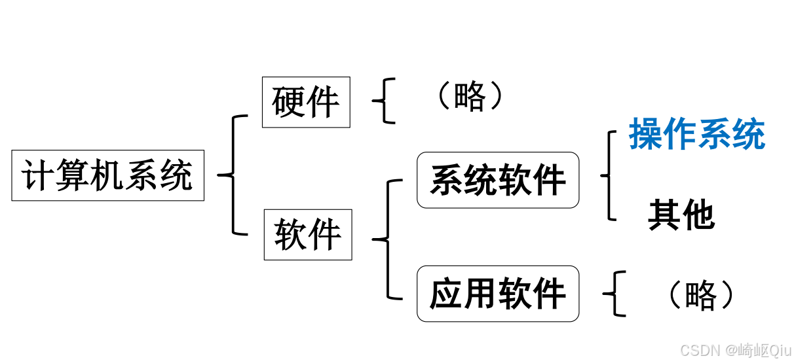
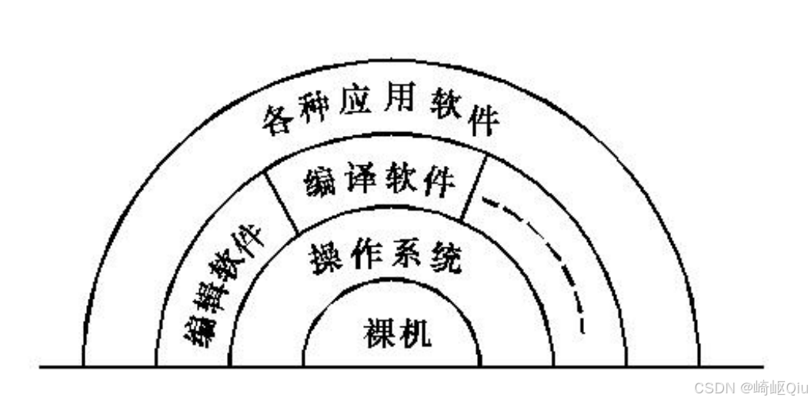
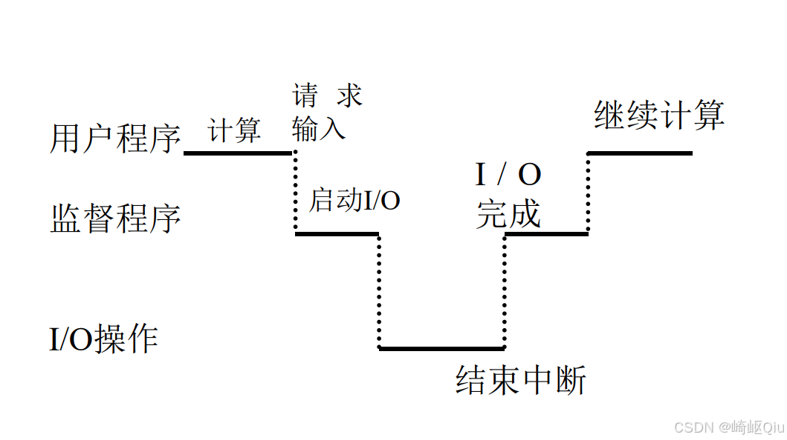
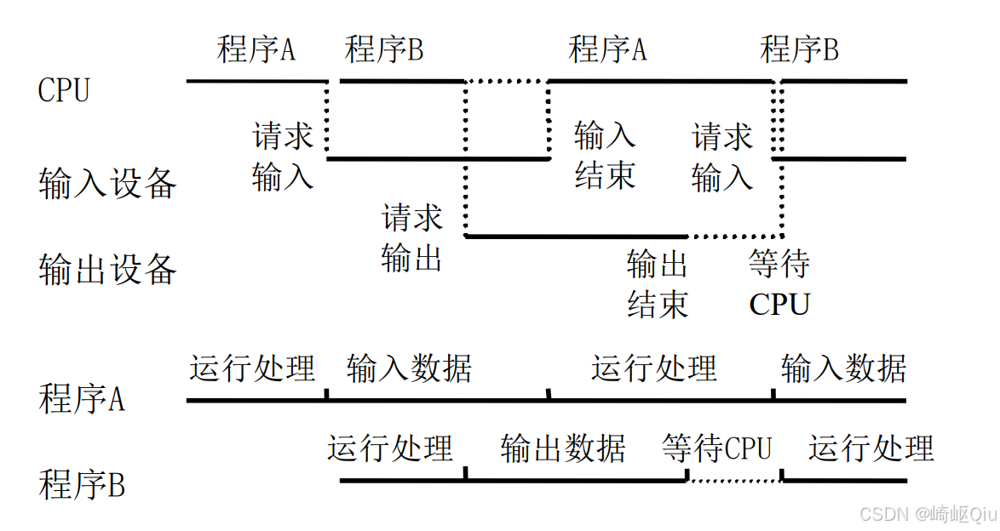
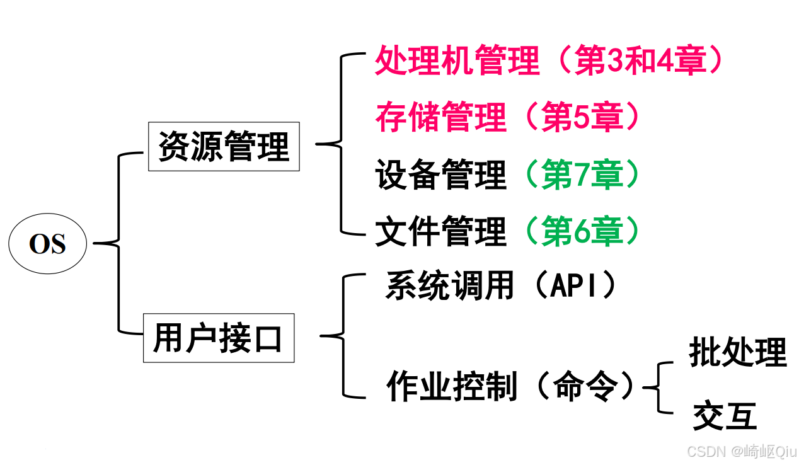

# 【OS笔记01】：操作系统引论

> 原创 于 2025-09-29 08:55:03 发布 · 公开 · 1.1k 阅读 · 25 · 8 · CC 4.0 BY-SA版权 版权声明：本文为博主原创文章，遵循 CC 4.0 BY-SA 版权协议，转载请附上原文出处链接和本声明。
> 文章链接：https://blog.csdn.net/lyh2004_08/article/details/152251975

**文章目录**

[TOC]

## 第一章：操作系统引论

### 1.1 操作系统概念

操作系统（Operating System, **OS** ）是计算机系统中的一种 **系统软件** 。

它的主要作用有两个方面：

1.  **管理和控制** 计算机系统中的硬件及软件资源。

2. 在计算机与用户之间起到 **接口** 的作用。

>  **思考：** 什么是系统软件？
> 
> 答：系统软件是指为计算机提供最基本功能，并支持应用软件运行的软件。操作系统是其最核心的部分。

#### 计算机系统的组成

一个计算机系统可以看作由 **硬件** 和 **软件** 两大部分组成。

-  **软件** 又可以进一步划分为：

  -  **系统软件** ：包括操作系统和其他如编译程序、诊断程序等。

  -  **应用软件** ：为了解决用户特定问题而编制的软件，如Office、QQ等。

 

#### 操作系统与硬件、软件的关系

操作系统是计算机系统的核心，它直接运行在裸机（硬件）之上，为上层的编译软件、各种应用软件提供服务和支持，管理着所有硬件资源。它们的关系可以看作一个层次结构。

 

#### 习题

- 在计算机系统中，操作系统是 ______ 。
  A. 一般应用软件
   **B. 核心系统软件** 
  C. 用户应用软件
  D. 硬件

>  **参考答案：B** 

---

### 1.2 操作系统的历史

操作系统的发展经历了以下几个主要阶段：

- 手工操作阶段

- 批处理系统

- 执行系统

-  **多道程序系统** 

-  **分时系统** 

- 实时系统

- 通用操作系统

- 网络操作系统

- 分布式操作系统

- 等等

#### 1.2.2 批处理

-  **思想** ：将一批用户作业输入计算机，由系统自动一个接一个地处理。

-  **主要优点** ：节省了作业输入和准备时间，提高了计算机的处理效率。

-  **主要缺点** ：资源利用率低，因为当一个作业进行I/O操作时，CPU会处于空闲等待状态。

#### 1.2.3 多道程序系统

-  **思想** ：内存中同时存放多个程序。其核心思想是：各程序在某一时刻使用的计算机资源不一定相同，因此可以在同一时刻，“运行”多个程序，让它们分别使用不同的计算机资源。

-  **特点** ：

  -  **宏观上并行** ：从整体看，多个任务都在向前推进。

  -  **微观上串行** ：在单CPU的情况下，任一时刻只有一个程序在CPU上执行。

通过多道程序技术，可以显著提高系统资源的利用率，特别是CPU的利用率。

##### 单道与多道程序运行实例对比

-  **单道程序运行** ：当用户程序请求I/O操作时，CPU会一直等待，直到I/O操作完成并产生中断，才能继续计算。这期间CPU是被浪费的。

 

-  **多道程序运行** ：当程序A请求输入时，CPU可以不必等待，而是转去执行程序B。当程序B需要I/O时，可能程序A的I/O已经完成，CPU又可以转回去执行程序A。这样使得CPU、输入设备、输出设备等资源能够并行工作，大大提高了利用率。

 

#### 1.2.4 分时 (Time-Sharing)

-  **思想** ：由于CPU资源紧缺，将CPU的运行时间划分为很短的时间片（Time Slice），每个“进程”轮流使用一个时间片。如此循环往复，直到所有进程结束。

-  **特点** ：

  -  **宏观上并行** ：用户感觉多个程序在同时运行。

  -  **微观上串行** ：对于单CPU，任一时刻只有一个进程在执行。

#### 习题

- 一个多道批处理系统，提高了计算机系统的资源利用率，同时 ______ 。
  A. 减少各个作业的执行时间
   **B. 增加了单位时间内作业的吞吐量** 
  C. 减少了部分作业的执行时间
  D. 减少单位时间内作业的吞吐量

>  **参考答案：B** 
> 
>  **PS：** 吞吐量即增加单位时间里处理作业的个数。多道系统虽然不能减少单个作业的执行时间（甚至可能因为切换而略有增加），但可以在相同时间内完成更多的作业。

---

### 1.4 操作系统的功能

操作系统的功能主要分为两大模块： **资源管理** 和 **用户接口** 。

#### 资源管理

操作系统作为资源管理者，需要对计算机系统中所有的软硬件资源进行统一的调度和分配。

-  **处理机管理** (第3和4章)

-  **存储管理** (第5章)

-  **设备管理** (第7章)

-  **文件管理** (第6章)

#### 用户接口

操作系统为用户使用计算机提供了方便的接口。

-  **系统调用 (API)** ：这是操作系统提供给 **程序员** 的接口，允许应用程序通过预定义的函数来请求操作系统底层的服务（如读写文件、创建进程等）。

-  **作业控制 (命令)** ：这是操作系统提供给 **普通用户** 的接口，用户通过命令与系统交互，主要分为两种形式：

  -  **批处理** ：用户提交作业控制语言编写的命令脚本。

  -  **交互** ：用户通过命令行或图形界面直接输入命令。

 

#### 习题

- 操作系统提供给编程人员的接口是 ______ 。
   **A. 系统调用** 
  B. 子程序
  C. 库函数
  D. 高级语言

>  **参考答案：A** 