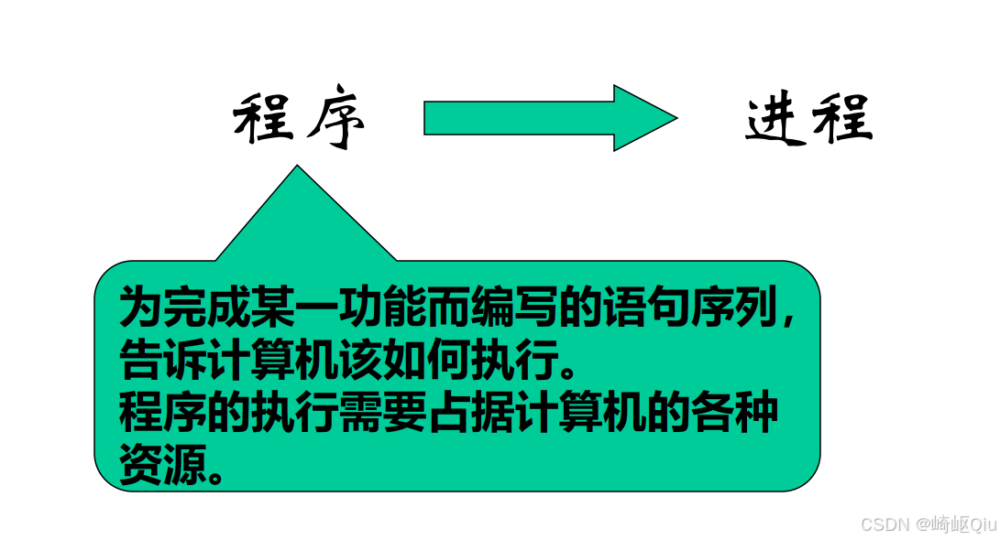
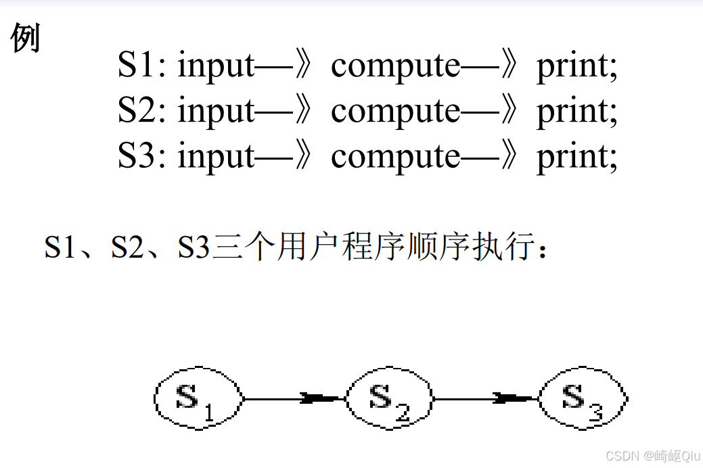
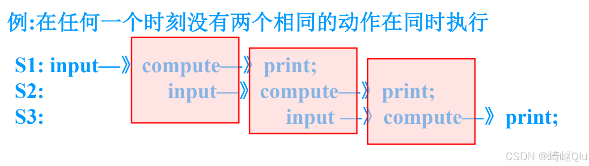
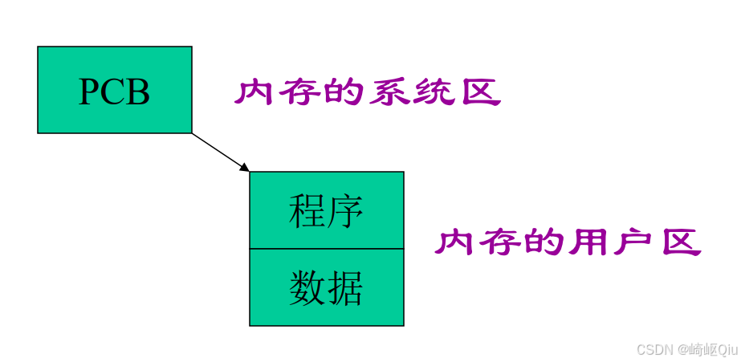
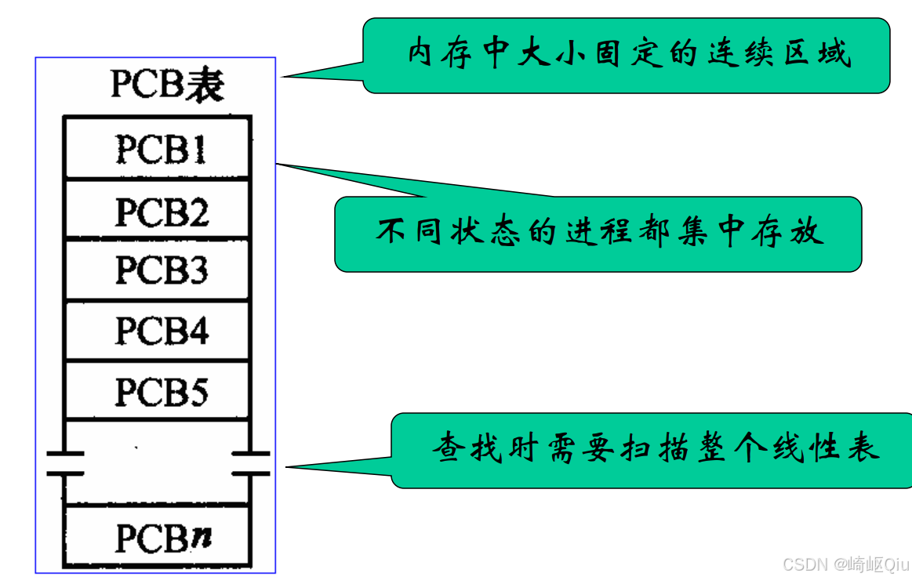
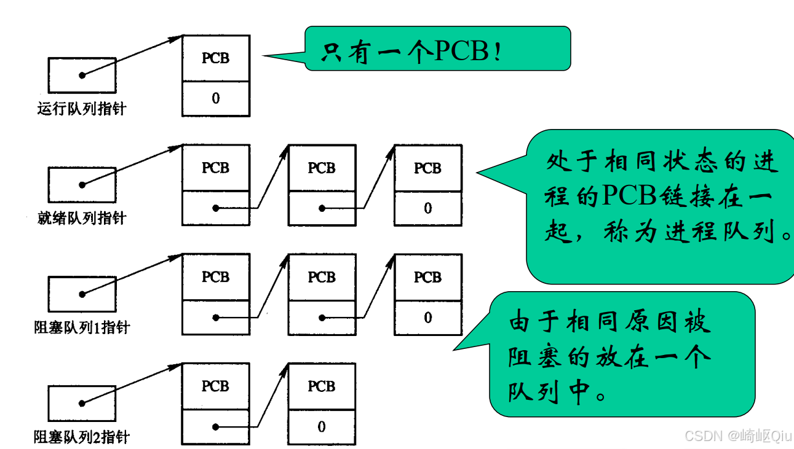
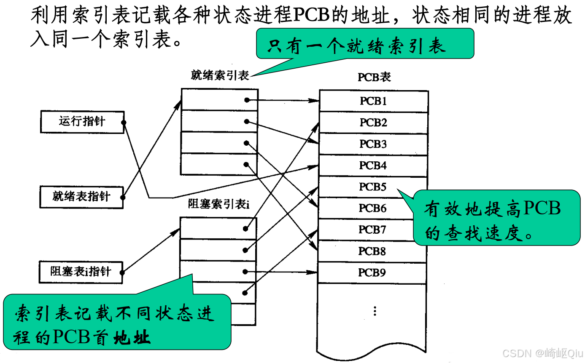

# 【OS笔记03】：进程和线程1

> 原创 于 2025-09-30 07:30:00 发布 · 公开 · 1k 阅读 · 13 · 16 · CC 4.0 BY-SA版权 版权声明：本文为博主原创文章，遵循 CC 4.0 BY-SA 版权协议，转载请附上原文出处链接和本声明。
> 文章链接：https://blog.csdn.net/lyh2004_08/article/details/152252998

**文章目录**

[TOC]

## 第三章 进程和线程 - part1

### 本章基本要求与重难点

| 基本要求 | 重难点 |
|:---|:---|
| 1. 掌握进程概念、组成、状态及转换，灵活分析问题。 |  **进程同步与互斥** 的概念。 |
| 2. 理解进程和程序的区别与联系、进程创建方法及功能。 | 运用 **信号量及PV操作** 实现进程的同步与互斥。 |
| 3. 掌握进程同步与互斥的概念，理解信号量及PV操作的定义和含义。 |  |

---

### 3.1 进程的概念

要理解什么是进程，首先要从“程序”以及程序的执行方式说起。

>  **程序是什么？** 
> 
> 程序是为了完成某一功能而编写的语句序列，它告诉计算机该如何执行。程序的执行需要占据计算机的各种资源。

从静态的“程序”代码，到动态的“进程”执行，是操作系统中的一次重要飞跃。

 

#### 3.1.1 程序的顺序执行

**定义** ：在一个程序段执行完之前，其它程序段只能等待。这种执行方式称为程序的 **顺序执行** 。

**三个主要特点** ：

1.  **顺序性** ：程序所规定的动作在机器上严格地按顺序执行。

2.  **封闭性** ：程序在运行时独占全机资源，只有程序自身的动作才能改变其运行环境。

3.  **可再现性** ：只要初始条件相同，无论程序执行多少次，都可以得到相同的结果。

 

##### 程序的并发执行

-  **背景** ：在单道程序系统中，任一时刻只有一个程序在运行，独占全部计算机资源，效率低下。

-  **发展** ：现代计算机广泛采用 **多道程序设计技术** ，使得多种硬件资源能够并行工作，从而提高资源利用率、运行速度和系统的处理能力。

-  **结果** ：程序的运行环境发生了根本变化，执行方式也从原来的 **顺序执行** ，变为 **并发执行** 。

**并发环境** 

> 在一段时间内，有两个或两个以上的程序同时处于从开始运行到尚未结束的状态。即：不同的程序在执行时间上是重叠的，在系统中交替执行。

 

###### 并发执行的特点

程序的并发执行，破坏了顺序执行的三个特点：

1.  **失去封闭性** ：多个程序共享系统中的各种资源，因此这些资源的状态将由多个程序来改变。一个程序运行时会受到另一个程序的影响。

2.  **相互制约** ：程序之间可能存在依赖关系，后面的模块需要等待前面的程序段传来的结果才能执行（如打印模块等待计算模块完成），导致“走走停停”。

3.  **不可再现性** ：程序在并发执行时，由于失去了封闭性（执行速度、资源竞争等外部因素会影响它），也导致了其结果的不可再现性。

> 例：有两个循环程序A和B，它们共享一个变量N。
> 
> 程序A每执行一次时，都要做 N∶=N+1 操作；
> 程序B每执行一次时，都要执行 Print(N) 操作，然后再将N置 0。
> 程序A和B以不同的速度运行。
> 
> 

1. N=N+1 在Print(N) 和 N=0 之前， 此时得到的N值分别为 n+1, n+1, 0

2. N=N+1 在Print(N) 和 N=0 之后， 此时得到的N值分别为 n, 0, 1

3. N=N+1 在Print(N) 和 N=0 之间， 此时得到的N值分别为 n, n+1, 0

**结论** ：程序在并发执行时，由于失去了封闭性，其计算结果已经和并发执行的速度有关，从而使程序失去了可再现性。即：程序经过多次执行后，虽然它们的初始条件相同，但得到的结果却不相同。

##### 顺序执行 对比 并发执行

| 顺序执行 | 并发执行 |
|:---|:---|
| 程序具有封闭性 | 程序失去封闭性 |
| 独享资源 |  **共享资源** (互为存在条件) |
| 可再现性 | 程序与“计算”不再一一对应 |
|  | 有相互制约 |

---

##### “进程”概念的引入

> 可见， **程序本身是静态的** ，它只是一个指令的集合，无法反应程序在并发执行时的动态特性。
> 
> 而操作系统需要管理和调度多个任务的并发运行。为了更好地描述和管理并发执行的特性，我们引入了 **“进程” (Process)** 的概念。

##### 并行 对比 并发

这两个概念非常重要，需要严格区分：

-  **并行 (Parallel)** ：同一 **时刻** ，两个事物均处于活动状态。（例如，在多核CPU上，两个程序在两个核上同时运行）。

-  **并发 (Concurrency)** ：宏观上存在并行特征，微观上存在顺序性。在同一 **时刻** ，只有一个事物处于活动状态。（例如，在单核CPU上，两个程序通过时间片轮转交替运行）。

---

#### 3.1.2 进程的定义

-  **较典型的定义** ：

  - 进程是程序的 **一次执行** ，是在给定的内存区域中执行一组指令序列的过程。

  - 进程是程序在一个数据集上运行的过程，它是系统进行 **资源分配和调度** 的一个独立单位。

-  **书上给出的定义** ：

  >  **进程** 是一个独立功能的程序关于某个数据集的一次运行活动，它也是系统进行 **资源分配和调度的基本单位** 。

##### 进程的特性

1.  **动态性** ：是程序的动态运行过程，有创建、运行、消亡的生命周期。

2.  **并发性** ：指多个进程实体同存于内存中，且能在一个时间段内同时运行。

3.  **独立性** ：各进程的地址空间相互独立，除非采用进程间通信手段。

4.  **结构化特征** ：进程由 **代码段、数据段、PCB（进程控制块）** 组成。

##### 进程和程序的联系和区别

1.  **静态 ↔ 动态 (根本区别)** 

   -  **程序** 是 **静态的** 、有序的代码集合。

   -  **进程** 是 **动态的** 、程序的执行过程。

2.  **对应关系** 

   - 进程和程序不是一一对应的。一个程序可以对应多个进程（例如，一个QQ程序被多个用户登录）。

     - 一个程序执行在不同的数据集上就成 为不同的进程，由于程序没有和数据产生直接的联系，既使是执行不同的数据的程序，他们的指令的集合依然是一样的；

     - 可以用 **进程控制块** 来唯一地标识运行于不同数据集上的同一
       个程序，而这一点 正是程序无法做到的。

3.  **生命周期** 

   -  **进程是暂时的** ，有创建有消亡，是一个状态变化的过程。

   -  **程序是永久的** ，可以长久保存在存储介质上。

4.  **组成不同** 

   -  **进程** 包括： **程序、数据和进程控制块(PCB)** 。

   -  **程序** 仅是指令序列。

5.  **创建能力** 

   - 进程具有创建其他进程的功能，而程序没有。

> ##### 总结

**进程是程序执行的动态过程；
> 程序是进程运行的静态文本。** 

##### 习题

1. 下面对进程的描述中，错误的是 _____ 。

   - A. 进程是有生命期的

   - B. 进程执行需要处理机

   -  **C. 进程是指令的集合** (这是程序的定义)

   - D. 进程是动态的概念

2. 多道程序环境下，操作系统分配资源以 _____ 为 **基本单位** 。

   - A. 作业

   -  **B. 进程** 

   - C. 指令

   - D. 程序

3. 并发进程失去了封闭性是指 _____ 。

   - A. 多个相对独立的进程以各自的速度向前推进

   - B. 并发进程的执行结果与速度无关

   - C. 并发进程执行时，在不同时刻发生的错误

   -  **D. 并发进程共享变量，其执行结果与速度有关** 

---

### 3.2 进程的描述

进程是一个实际存在的实体，它包括三个组成部分，这三部分也被称为“ **进程映像 (Process Image)** ”：

1.  **程序** ：完成独立功能的指令集合。

2.  **数据** ：程序运行时所作用的对象。

3.  **进程控制块 (PCB)** ：是进程的描述信息和控制信息， **PCB是进程存在的唯一标志** 。

从操作系统的角度看，它并不关心进程要完成什么具体任务，而是关心进程所需的 **资源** ，并对这些资源进行统一管理。由于进程的动态性，需要随时记录进程的相关信息， **PCB** 就是为此而生的数据结构，随进程的创建而创建，随进程的撤销而消失。

#### 3.2.1 进程控制块 (PCB)

PCB：Process Control Block，是系统对进程进行管理的依据。

**PCB包含的主要信息：** 

1.  **进程名** ：如 PID (Process Identifier)。

2.  **程序和数据地址** ：在内存和外存的地址。

3.  **进程的状态** ：如就绪、运行、阻塞等。

4.  **现场保护信息** ：如寄存器、指令计数器、状态字等，用于进程切换时恢复现场。

5.  **资源清单** ：所需全部资源及占用情况。

6.  **优先级** (可变)。

7.  **家族信息** ：如父进程、子进程等。

8.  **通信信息** ：与其他进程通信时有关的数据。

##### PCB的组织方式

为了有效管理多个PCB，系统将其按一定方式组织起来，存放在内存的 **系统区** 。

 

**三种常用的PCB组织方式：** 

1.  **线性表结构** 

   - 将所有PCB存放在内存中大小固定的连续区域（PCB表）。

   -  **缺点** ：查找时需要扫描整个线性表，效率较低。

 

1.  **链接表结构（进程队列）** 

   - 将处于 **相同状态** 的进程的PCB链接在一起，构成一个队列。

   - 例如，所有处于就绪状态的进程组成“就绪队列”，因等待打印机而被阻塞的进程组成“打印机阻塞队列”。

   - 系统持有指向各个队列头部的指针。

 

1.  **索引表结构** 

   - 为不同状态的进程建立索引表，索引表记录了对应状态下各进程PCB的地址。

   - 查找时，先通过状态找到对应的索引表，再通过索引表快速定位到PCB，有效地提高了查找速度。

 

